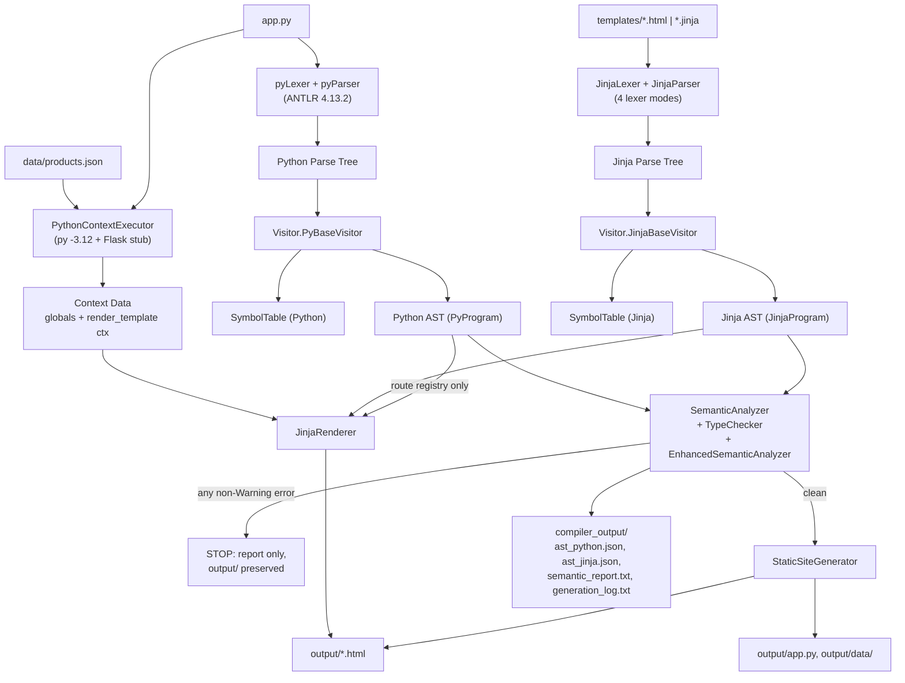
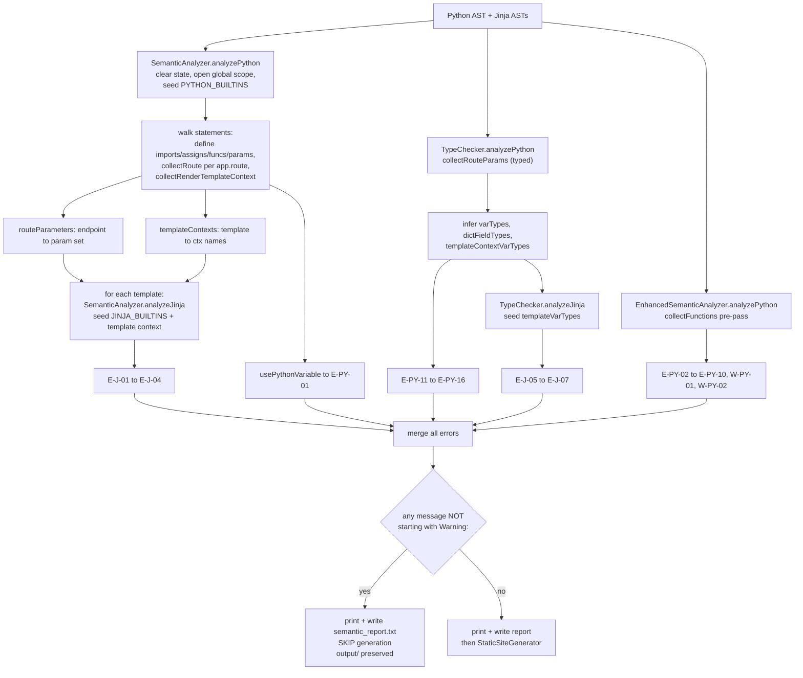

# PROJECT_AUDIT.md — Compilers Course Project, Technical Audit

**Repository:** `Compiler_Project` · **Branch:** `main` · **HEAD:** `c4359e8 "catches all errors"`
**Audit date:** 2026-08-30 · **Audit machine:** Windows 11 Pro 26200, OpenJDK Corretto 17.0.17, ANTLR 4.13.2, Python 3.12.10
**Scope:** read-only technical audit (original pass). A **POST-FIX UPDATE** section at the end of this file records the fix session that followed. No source file was modified. Every claim below is backed by a file path and, where useful, a line range. Where something is missing or partial it is stated explicitly in **Step 3 — Gaps & risks**.

> **Reading rule used in this audit:** `COMPILER_FLOW.md` was treated as a *hypothesis*. Every statement in it was re-verified against the code and against live runs. Where the code disagrees with `COMPILER_FLOW.md`, this document follows the code and says so.

---

## Step 0 — Orientation

### 0.1 Verdict on `COMPILER_FLOW.md`

`COMPILER_FLOW.md` is broadly accurate. The following statements were **verified true**: the pipeline shape (§1), the default input paths (§2), the grammar file list (§3), the error-listener format and the "no generation on parse error" policy (§4), the AST node inventories (§5), the `url_for` cross-check (§6), the type-system inventory (§7), the JSON-first products precedence (§9), the AST-driven renderer (§10), the artefact list (§11), the `output/` vs `generated_app/` distinction (§13), and the four integration tests (§14).

The following statements were found **inaccurate or incomplete**:

| `COMPILER_FLOW.md` claim | Reality | Evidence |
|---|---|---|
| §3 "`src/pyAntlr/`, `src/jinjaAntlr/` are ANTLR-generated files" | True for the **`.java`** files. But the **`.g4` and `.interp` copies inside those directories are stale** and do not match `grammars/`. `src/jinjaAntlr/JinjaParser.g4` still has `jinjaExpression : jinjaPrimary ...`, `package antlr`, and no `~` / comparison / `ParenthesizedExpr` rules. | `diff grammars/JinjaParser.g4 src/jinjaAntlr/JinjaParser.g4` |
| §3 regeneration command shown only for Jinja | The Python side regenerates identically; verified by regenerating both into a scratch dir and diffing. | Verification log V9 |
| §6 "Considers Python built-ins currently used, e.g. `open` and `__file__`" | True, but the two analyzers keep **two different built-in sets** that disagree (`SemanticAnalyzer` has `__name__`,`__file__`; `EnhancedSemanticAnalyzer` has `sum`,`max`,`min`,`sorted`,…). | `src/semantic/SemanticAnalyzer.java:127-130` vs `src/semantic/EnhancedSemanticAnalyzer.java:26-30` |
| §6 lists "attribute incompatible with `str`/`list`/`dict`", "index incompatible with container type" as working Enhanced checks | **These three checks never fire** on real parsed input. `EnhancedSemanticAnalyzer.inferSimpleType` cannot see through the `UnaryPostfixExpr → PostfixExpr → literal` shape the parser actually produces, so every variable type is `"unknown"` and the guards short-circuit. Proven by fixture (Verification log V7). | `src/semantic/EnhancedSemanticAnalyzer.java:293-313`, guards at `:194`, `:278-283` |
| §10 "represents the CSS present in the AST" | True but **lossy**: the descendant combinator and value commas are dropped. `.nav-links a` renders as `.nav-linksa`; `rgba(0, 0, 0, 0.1)` renders as `rgba(0 0 0 0.1 )`. | `output/index.html:14`; grammar `grammars/JinjaParser.g4:85-92` |
| §12 setup uses `py -3.12` | `py -3.12` is **hardcoded** in the generator and in a test. On a machine without Python 3.12 the whole generation phase throws. Confirmed live before Python 3.12 was installed. | `src/codegen/PythonContextExecutor.java:44`; Verification log V3 |
| §14 "Last verified state … all PASS" | Re-verified today: all four tests pass, **but only after installing Python 3.12**. `JinjaValidationIntegrationTest` also **overwrites the project's `compiler_output/`** because it passes only 3 CLI args. | Verification log V5, V6 |
| §8 "permanent delete not implemented yet" | Confirmed — `delete_product` re-renders the index and never mutates or saves `products`. | `app.py:64-66` |

### 0.2 Repository map

Directories `.build/`, `.venv/` and the *internals* of `src/pyAntlr/`, `src/jinjaAntlr/` are listed but not expanded, per the audit brief.

```
Compiler_Project/
├── COMPILER_FLOW.md               design/flow reference (Arabic)
├── README.md                      run instructions
├── PROJECT_AUDIT.md               ← this file
├── Compiler_Project.iml           IDE module file
├── .gitignore                     2 lines only: "out/", "*.class"
├── app.py                         70 lines — the Flask input program (R6 web app)
├── test.py                        41 lines — legacy/alternate Python input, NOT used by Main
├── grammars/                      AUTHORITATIVE grammars
│   ├── pyLexer.g4                 181 lines
│   ├── pyParser.g4                209 lines
│   ├── JinjaLexer.g4              111 lines
│   └── JinjaParser.g4             102 lines
├── dependencies/
│   └── antlr-4.13.2-complete.jar  ANTLR 4 Tool, Implementation-Version 4.13.2
├── src/
│   ├── app/Main.java              236 lines — driver / phase orchestration
│   ├── ast/MainProgram.java       4 lines — empty common root of both ASTs
│   ├── pyAntlr/                   [generated, 12 files] pyLexer/pyParser + Visitor/Listener bases
│   ├── jinjaAntlr/                [generated, 12 files] JinjaLexer/JinjaParser + Visitor/Listener bases
│   ├── PyClasses/                 54 Java files — Python AST nodes
│   ├── jinjaClasses/              63 Java files — Jinja/HTML/CSS AST nodes
│   ├── visitor/Visitor.java       1240 lines — BOTH visitors (parse tree → AST)
│   ├── sharedSymbolTable/
│   │   ├── Symbol.java            57 lines
│   │   └── SymbolTable.java       323 lines
│   ├── semantic/
│   │   ├── SemanticAnalyzer.java          612 lines
│   │   ├── EnhancedSemanticAnalyzer.java  356 lines
│   │   └── TypeChecker.java               674 lines
│   └── codegen/
│       ├── StaticSiteGenerator.java   42 lines  — CURRENT output path
│       ├── JinjaRenderer.java         93 lines  — AST → HTML
│       ├── PythonContextExecutor.java 81 lines  — runs Python 3.12 with a Flask stub
│       ├── CompilerArtifactWriter.java 22 lines — compiler_output/*
│       └── CodeGenerator.java        222 lines  — LEGACY, not called by Main
├── templates/                     Jinja input
│   ├── base.html (258)  index.html (22)  add_product.html (31)
│   ├── product_detail.html (26)  test.html (9)
│   └── (no style.css / script.js present in this repo)
├── data/products.json             5 products — the persistent store
├── output/                        GENERATED deliverable
│   ├── index.html  add_product.html  product_detail.html  test.html
│   ├── app.py                     copied byte-for-byte
│   └── data/products.json         copied
├── compiler_output/               GENERATED reports
│   └── ast_python.json  ast_jinja.json  semantic_report.txt  generation_log.txt
├── generated_app/                 LEGACY output of CodeGenerator (stale, built from test.py)
│   ├── app.py  config.py  requirements.txt
│   └── templates/{base,index,add_product,product_detail,test}.html
├── tests/                         4 plain-`main` integration tests, no JUnit
│   ├── JinjaValidationIntegrationTest.java     (37)
│   ├── CodeGeneratorIntegrationTest.java       (81)
│   ├── PersistentProductsIntegrationTest.java  (86)
│   └── EnhancedSemanticReportIntegrationTest.java (54)
├── .build/                        [compiled classes + stray tracked .pyc files]
├── .venv/                         [Python virtualenv — TRACKED IN GIT, see Gaps]
└── .idea/ , Compiler/.idea/       [IDE state — tracked in git]
```

**Missing from the required folder list:** the announcement asks `output/` to contain `style.css` and `script.js`. Neither file exists anywhere in this repo, so nothing is copied. The copy logic itself is present and correct (`src/codegen/StaticSiteGenerator.java:26-30`) and is proven to work by `tests/PersistentProductsIntegrationTest.java:16-17,58-61`, which creates the two files in a fixture.

### 0.3 Build & first run

Exact commands and results are in the **Verification log** at the end. Summary:

| Step | Command | Result |
|---|---|---|
| Compile compiler | `javac -encoding UTF-8 -cp dependencies/antlr-4.13.2-complete.jar -d .build/classes <all src/**/*.java>` | **PASS** (one unchecked-operation note only) |
| Compile tests | `javac -encoding UTF-8 -cp ".build/classes;…jar" -d .build/classes tests/*.java` | **PASS** |
| Run compiler (before Py 3.12) | `java -cp ".build/classes;…jar" app.Main` | **FAIL** — `IOException: Python context execution failed: No suitable Python runtime found` at `PythonContextExecutor.java:47` |
| Run compiler (after Py 3.12) | same | **PASS** — 5 templates parsed, no semantic errors, `output/` + `compiler_output/` written |
| `JinjaValidationIntegrationTest` | `java -cp … JinjaValidationIntegrationTest` | **PASS** |
| `CodeGeneratorIntegrationTest` | `java -cp … CodeGeneratorIntegrationTest` | **PASS** |
| `PersistentProductsIntegrationTest` | `java -cp … PersistentProductsIntegrationTest` | **PASS** |
| `EnhancedSemanticReportIntegrationTest` | `java -cp … EnhancedSemanticReportIntegrationTest` | **PASS** |

---

## Step 1 — Course requirements status (R1–R7)

| Req | Status | Evidence | What would close the gap |
|---|---|---|---|
| **R1** Lexer+Parser with grammars for Python(Flask subset), Jinja2, HTML, CSS | ⚠️ **partial** | Python: `grammars/pyLexer.g4`, `grammars/pyParser.g4`. Jinja+HTML+CSS are **one** grammar pair using lexer modes: `grammars/JinjaLexer.g4:1-111` (modes *default*, `TAG_MODE`, `CSS_MODE`, `JINJA_MODE`), `grammars/JinjaParser.g4:6-102`. All four *languages* are covered; they are not four separate grammar files. | Nothing functionally; if the rubric literally requires 4 grammar files, split `JinjaParser.g4` into `HtmlParser.g4` + `CssParser.g4` + `JinjaParser.g4` with imports. |
| **R2** Two ASTs; Generator passes the Python data array into the Jinja tree | ⚠️ **partial** | Two ASTs exist: `src/PyClasses/` (54 nodes, root `PyProgram`) and `src/jinjaClasses/` (63 nodes, root `JinjaProgram`). Data **does** reach the Jinja tree and renders (`output/index.html` contains all 5 products). **But the data is not taken from the Python AST** — it is obtained by *executing* `app.py` in a Python 3.12 subprocess (`src/codegen/PythonContextExecutor.java:16-49`) and then overridden by `data/products.json` (`:62-72`). The only thing `StaticSiteGenerator` reads from the Python AST is the route registry (`src/codegen/StaticSiteGenerator.java:40`). | Add an AST-literal evaluator (walk `ListLiteralExpr`/`DictLiteralExpr`/`IntExpr`/`StringExpr`) and use it as the primary source, keeping subprocess execution only as a fallback. See P0-1. |
| **R3** OOP AST: inheritance + polymorphism; **every** node stores its line (ideally column) | ⚠️ **partial** | Inheritance/polymorphism: solid on both sides (§2.2). **Python side: every node carries a line** — `Visitor.setLine` is called in all 55 Python visit methods (`src/visitor/Visitor.java:726-731`, call sites `:747`–`:1227`). **Jinja side: line is set on only 8 node kinds** (`JinjaProgram`, `StyleTag`, `PairedTag`, `SelfClosingTag`, `HtmlText`, `ControlBlock`, `PrintBlock`, `JinjaBinaryExpr`). Seven Jinja base classes have **no line field at all**. **No node on either side stores a column.** | Make `JinjaPrimary`/`Access`/`HtmlAttribute`/`AttributeValue`/`JinjaCallArgs`/`CssValue`/`SelectorPart` extend a common `JinjaNode` with `line`+`column`; add `column` to `PyProgram`. See P0-2. |
| **R4** Semantic analysis on **both** sides, ≥5 handled errors | ✅ **implemented** | Python side: **13 distinct blocking** diagnostics + 2 warnings, all reproduced live (§2.4, Verification log V7). Jinja side: **7 distinct blocking** diagnostics reproduced live (V8). Both sides comfortably exceed 5. | Nothing required. (Three further Enhanced checks exist but are unreachable — see P1-1.) |
| **R5** Code generation: Python context → Jinja → HTML; regeneration cycle works | ✅ **implemented** | `src/codegen/StaticSiteGenerator.java:12-34` + `src/codegen/JinjaRenderer.java`. Regeneration verified **live** today: appending a product to `data/products.json` and re-running `app.Main` added exactly the expected card to `output/index.html`, including `url_for` → `/product/6` and `"%.2f"|format` → `$7.25` (Verification log V10). | Nothing required. |
| **R6** Web UI: list / add / detail / delete | ⚠️ **partial** | list `/` ✅ (`app.py:28-30`), add `/add` GET+POST ✅ with persistence ✅ (`app.py:41-61`), detail `/product/<int:product_id>` ✅ (`app.py:33-38`), delete `/delete/<int:product_id>` ❌ — the handler **never removes anything and never saves**; it just re-renders the index (`app.py:64-66`). Navigation between pages ✅ (§2.6). | 3-line fix in `delete_product`: filter `products` by id, call `save_products_to_json(products)`, `redirect(url_for('index'))`. See P0-3. |
| **R7** Print method on every node (node + children) **and** a whole-tree + symbol-table printer | ⚠️ **partial** | Per-node printing: **every concrete node overrides `toString()`** (47/54 `PyClasses`, 54/63 `jinjaClasses`; the only classes without one are the abstract bases). Whole-tree print: `Main.java:193-194` (Python) and `:223-224` (Jinja). Symbol-table print: `SymbolTable.printTable()`/`getStatistics()` at `Main.java:196-198` and `Visitor.java:53-54, 754-755`. **Gap: there is no single function that prints "the whole tree together with the symbol table"** — they are two separate prints, the Python table is printed **twice** (Visitor + Main), and the **Jinja symbol table is never printed by `Main`** (only incidentally by the Visitor). | Add `Main.dumpProgram(ast, symbolTable)` that prints tree + table in one call; remove the duplicate print in `Visitor`. See P1-2. |
| **Required output folders** | ⚠️ **partial** | `output/` has `index.html`, `add_product.html`, `product_detail.html`, `test.html`, `app.py`, `data/products.json` ✅ — but **no `style.css`, no `script.js`** because neither exists as an input. `compiler_output/` has all four required files ✅. The announcement's "edit/detail html" is satisfied by `product_detail.html`. | Add `style.css` and `script.js` beside `app.py` or in `templates/`; the copier already handles them. See P0-4. |

---

## Step 2 — Phase-by-phase documentation

### Overall pipeline



---

### 2.1 Grammars & Lexer/Parser

#### 2.1.1 `grammars/pyLexer.g4` (181 lines) — Python lexer

**Purpose:** tokenise the supported Flask/Python subset, *including synthetic INDENT/DEDENT*, which pure ANTLR cannot do.

- **Indentation handling** is a hand-written `nextToken()` override (`:15-85`). It keeps `Deque<Integer> indents` and a `LinkedList<Token> pending`, plus an `opened` bracket-depth counter (`:31-32`). Inside `()`/`[]`/`{}` (`opened > 0`) NEWLINEs are **swallowed entirely** (`:47-49`) — this is what lets multi-line list/dict literals parse. At EOF all open indents are flushed as DEDENTs (`:35-41`).
- Indentation width is computed from the **trailing whitespace of the NEWLINE token itself** (`:60-67`), because `NEWLINE : ('\r'? '\n') [ \t]*` (`:175-177`) deliberately absorbs the following indentation.
- **Rule ordering that matters (the examiner will ask):**
  1. **Keywords before `ID`** (`:111-131` before `:154`). ANTLR resolves equal-length matches by *declaration order*, so `for`, `def`, `app`, `render_template`, `url_for` etc. must precede `ID` or they would all lex as `ID`.
  2. **`ROUTE : '@app.route'` (`:126`) is a single token**, declared before `APP` and `DOT`. This is why `route_def` can start with one terminal instead of a decorator sub-grammar.
  3. **`ROUTE_PATH` (`:134-137`) before `HTML_FILE` (`:142-145`) before `STRING` (`:151-152`).** All three match quoted text. `ROUTE_PATH` only matches quotes whose first character is `/`; `HTML_FILE` only matches quotes ending in `.html`. Because ANTLR prefers the **longest** match and then the **earliest declared**, `'/add'` becomes `ROUTE_PATH` and `'index.html'` becomes `HTML_FILE`, while everything else falls through to `STRING`. Reordering these three breaks `route_path` and `render_template`.
  4. **`FLOAT` (`:150`) after `INT` (`:149`) is safe** only because ANTLR is longest-match: `1.5` matches FLOAT (3 chars) over INT (1 char).
  5. **`WS -> skip` (`:179`) is declared after `NEWLINE`** so a newline is never eaten as whitespace.
- **Known lexer limitation:** `INT : '-'? [0-9]+` and `FLOAT : '-'? …` fold the minus sign into the literal, which conflicts with the `MINUS` operator token. `products[-1]` works (parsed as `IntExpr(-1)`), but `a -1` lexes as `a`, `INT(-1)`.

#### 2.1.2 `grammars/pyParser.g4` (209 lines) — Python parser

- Entry rule `pyProgram : (statement | NEWLINE)* EOF` (`:10-12`).
- `statement` (`:23-32`) uses **labelled alternatives** (`#ImportStatement`, `#AssignmentStatement`, …), which is what generates the distinct `visitXxx` methods the Visitor overrides.
- `identifier` (`:14-21`) deliberately re-admits the reserved Flask tokens (`APP`, `RENDER_TEMPLATE`, `REQUEST`, `REDIRECT`, `URL_FOR`) as ordinary identifiers, undoing the lexer's keyword promotion where it would otherwise break `render_template(...)`.
- **Expression precedence is encoded by rule nesting, not by ANTLR precedence:** `expr → orExpr → equalityExpr → relationalExpr → additiveExpr → multiplicativeExpr → unaryExpr → postfixExpr → primaryExpr` (`:118-177`). **Ordering matters:** the outermost rule binds loosest. Swapping `additiveExpr` and `multiplicativeExpr` would make `2 + 3 * 4` parse as `(2+3)*4`.
- `postfixExpr : primaryExpr (postfixOp)*` with `postfixOp` = call / subscript / attribute (`:153-161`). This is the single most important rule for the semantic phase: `os.path.join(...)`, `request.form["name"]`, `products[-1]["id"]` are all one `PostfixExpr` with an ordered op list.
- `suite` (`:71-74`): `IndentedSuite` (NEWLINE+ INDENT … DEDENT) **before** `SimpleSuite` (a bare statement). Order matters — ANTLR's ALL(*) would otherwise commit to the single-statement form.
- `route_def : ROUTE L_PAREN route_path (COMMA NEWLINE? route_params)? R_PAREN NEWLINE func_def` (`:81-83`) — the decorator and the function are **fused into one parser rule**, which is why `RouteStatement` owns its `FuncDefStatement` in the AST.
- `generator_expr` (`:180-182`) is a narrow special case supporting exactly `(p for p in xs if cond)`, needed by `app.py:35`.

#### 2.1.3 `grammars/JinjaLexer.g4` (111 lines) — Jinja + HTML + CSS lexer

This is the interesting one: **four lexer modes** implement three embedded languages.

| Mode | Entered by | Left by | Purpose |
|---|---|---|---|
| *default* (HTML text) | — | — | HTML character data |
| `TAG_MODE` | `TAG_OPEN '<'` (`:12`), `TAG_CLOSE_START '</'` (`:13`) — `pushMode` | `TAG_CLOSE '>'` (`:28`), `TAG_SLASH_CLOSE '/>'` (`:29`) — `popMode` | tag name, attributes, attribute values |
| `CSS_MODE` | `STYLE_OPEN : '<style' .*? '>'` (`:17`) — `pushMode` | `STYLE_CLOSE : '</style>'` (`:49`) — `popMode` | CSS rules inside `<style>` |
| `JINJA_MODE` | `{%` / `{{` from default mode (`:9-10`) **and** `` (`:69`), `}}` (`:70`) — `popMode` | Jinja expressions and statements |

Key answers to likely examiner questions:

- **How are `{{ }}` and `` distinguished?** Two separate start tokens, `JINJA_EXPR_START '{{'` and `JINJA_BLOCK_START '` vs `}}`) pops the mode.
- **Why the duplicated `TAG_JINJA_*` tokens?** Because `{{ }}` may appear inside a tag (`href="{{ url_for(...) }}"`, or bare `<a …>`), and a mode only recognises its own token set. Hence `TAG_JINJA_BLOCK_START`/`TAG_JINJA_EXPR_START` (`:40-41`) duplicate the entry from `TAG_MODE`. The parser accepts either via `(JINJA_BLOCK_START | TAG_JINJA_BLOCK_START)` (`JinjaParser.g4:35-36`).
- **How is HTML text tokenised without swallowing tags or Jinja?** `HTML_TEXT: (~[<{] | '<' ~[a-zA-Z/!{] | '{' ~[%{#])+` (`:20`). It accepts any character that is not `<` or `{`, **or** a `<` that is not the start of a tag/comment/doctype, **or** a `{` that is not `{%`, `{{`, or `{#`. This is the rule that makes `a < b` in prose survive.
- **Rule ordering that matters:**
  1. In default mode, `JINJA_BLOCK_START`/`JINJA_EXPR_START` (`:9-10`) are declared **before** `TAG_OPEN` and before `HTML_TEXT`. Note that `HTML_COMMENT`, `DOCTYPE` and `STYLE_OPEN` (`:15-17`) are declared **after** `TAG_OPEN` (`:12`); this works only because ANTLR prefers the **longest** match — `<!--…-->`, `<!DOCTYPE…>` and `<style…>` are all longer than the 1-character `<`. This is a fragile-but-correct ordering the examiner may probe.
  2. `DOCTYPE -> skip` (`:16`) means **the doctype is silently dropped**, which is why generated `output/*.html` files start with a blank line and no `<!DOCTYPE html>`.
  3. `HTML_COMMENT -> channel(HIDDEN)` (`:15`) — comments are tokenised but not delivered, so `<!-- Delete form -->` disappears from the output.
  4. In `JINJA_MODE`, keywords `extends|block|endblock|if|for|in|else|endif|endfor|true|false|none|format` (`:72-84`) precede `JINJA_IDENTIFIER` (`:107`) — same keyword-before-identifier rule as Python.
  5. **Two-character operators before one-character**: `JINJA_EQ '=='`, `JINJA_NEQ '!='`, `JINJA_LE '<='`, `JINJA_GE '>='` (`:90-93`) are declared before `JINJA_EQUALS '='`, `JINJA_LT '<'`, `JINJA_GT '>'` (`:94, 100-101`). ANTLR's longest-match makes this correct anyway, but the ordering documents intent.
  6. In `CSS_MODE`, `STYLE_CLOSE '</style>'` (`:49`) must precede everything else so CSS content cannot swallow the closing tag.
- **Known lexer limitation:** `CSS_WS -> channel(HIDDEN)` (`:63`) hides whitespace, so the CSS **descendant combinator is lost** — `.nav-links a` and `.nav-linksa` become indistinguishable in the parse tree.

#### 2.1.4 `grammars/JinjaParser.g4` (102 lines)

- `jinjaProgram : documentElement* EOF` (`:6`); `documentElement` is `styleTag | jinjaBlock | htmlTag | htmlText` (`:8-13`).
- **The template is a FLAT list, not a nested tree, with respect to control flow.** ``, ``, ``, ``, ``, ``, `` are each independent `ControlBlock` siblings (`:34-48`) — the grammar does **not** pair them. Pairing is done later, at render time, by scanning forward for the matching terminator (`src/codegen/JinjaRenderer.java:47, 53-65`). This is a deliberate design choice worth defending: it keeps the grammar LL-friendly and lets a `` span across HTML tag boundaries. Its cost is that **an unbalanced `` without `` is not a parse error** and is not diagnosed anywhere.
- `htmlTag` alternatives are ordered `PairedTag` then `SelfClosingTag` (`:17-20`). **Ordering matters:** both start `TAG_OPEN TAG_ID htmlAttribute*`; ANTLR's adaptive prediction distinguishes them by the `TAG_CLOSE` vs `TAG_SLASH_CLOSE` lookahead. Note there is **no HTML void-element handling** — `` written without `/>` would be parsed as an unterminated `PairedTag`. The project's templates always write ``, `<input … />`, `<meta … />`.
- Jinja expression precedence is again nesting-encoded (`:50-54`): `jinjaExpression → jinjaComparison → jinjaAdditive → jinjaMultiplicative → jinjaPrimary`, with filters applied *outside* comparison (`jinjaExpression : jinjaComparison (JINJA_PIPE jinjaFilter)*`). So `a + b | upper` filters the whole sum — correct Jinja semantics.
- `jinjaCallArgs` alternatives ordered `CallMixedArgs`, `CallKwArgs`, `EmptyArgs` (`:69-73`). **Ordering matters:** `CallMixedArgs` requires at least one positional argument, so `url_for('x', id=1)` takes it; `url_for(id=1)` falls to `CallKwArgs`; `url_for()` to the empty alternative. Putting `EmptyArgs` first would make it match everything, since it is epsilon.
- The CSS section (`:81-102`) is a small but real CSS grammar: rules, selector lists, class/tag selector parts, one pseudo-class, properties, comma-separated value lists, colours, numbers with units, and `fn(...)` values.

#### 2.1.5 ANTLR version, regeneration, and "generated, not hand-edited"

- **ANTLR version:** 4.13.2 (`dependencies/antlr-4.13.2-complete.jar`, MANIFEST `Implementation-Version: 4.13.2`).
- **Regeneration commands** (run from `grammars/`):
  ```powershell
  java -jar ..\dependencies\antlr-4.13.2-complete.jar -encoding UTF-8 -visitor -listener -o ..\src\jinjaAntlr JinjaLexer.g4 JinjaParser.g4
  java -jar ..\dependencies\antlr-4.13.2-complete.jar -encoding UTF-8 -visitor -listener -o ..\src\pyAntlr   pyLexer.g4  pyParser.g4
  ```
- **Proof that `src/pyAntlr` and `src/jinjaAntlr` are generated and not hand-edited:** both were regenerated into a scratch directory from `grammars/*.g4` and diffed against the checked-in files. `JinjaLexer.java`, `JinjaParser.java`, `JinjaParserBaseVisitor.java` and `pyParser.java` are **byte-identical ignoring the first `// Generated from …` comment line**. `pyLexer.java` differs **only** in the encoding of two Arabic comments (the audit regeneration omitted `-encoding UTF-8`). (Verification log V9.)
- **Caveat:** the `.g4` and `.interp` *copies* that live inside `src/jinjaAntlr/` and `src/pyAntlr/` are **stale artefacts** of older generations (`src/jinjaAntlr/JinjaParser.g4` declares `package antlr` and lacks the comparison/additive/multiplicative rules and `~`). They are neither compiled nor read at runtime, but they will mislead a reader. See P2-2.

#### 2.1.6 The custom error listener

- **Class:** an anonymous `BaseErrorListener` held in the static field `Main.COLLECTING_LISTENER` (`src/app/Main.java:36-46`).
- **What it captures:** *both* lexer and parser errors — it is installed on all four recognisers after `removeErrorListeners()` (`Main.java:175-176, 180-181, 208-209, 213-214`), which removes ANTLR's default `ConsoleErrorListener`.
- **Format:** `filename:line:column message`, e.g.
  `C:\…\input.py:2:0 mismatched input '<EOF>' expecting {ID, ')'}`
  (`Main.java:44`; the filename comes from the static `parsingFile` field set at `:170` and `:205`).
- **Policy on parse errors — verified:**
  - The AST is **not** built: `processPythonFile` / `processHtmlFile` `return null` before the Visitor runs (`Main.java:185`, `:218`).
  - Semantic analysis and generation do **not** run: `printParseErrorsAndStop()` is checked immediately after each parse (`Main.java:62`, `:90`) and `main` returns.
  - **No compiler artefacts are written either** — `CompilerArtifactWriter.write` sits at `Main.java:113`, *after* the parse gate, so on a parse error `compiler_output/` still holds the previous run's files. (`COMPILER_FLOW.md` §15 states this correctly.)
  - **The previous `output/` is preserved**, because the only thing that deletes it is `StaticSiteGenerator.recreate` (`src/codegen/StaticSiteGenerator.java:41`), reached only on a clean run.
  - Verified by `tests/JinjaValidationIntegrationTest.java:28-36` (`def broken(` → no output directory) and reproduced live (Verification log V6).

---

### 2.2 AST design (OOP)

#### Python AST hierarchy

```mermaid
classDiagram
    class MainProgram
    class PyProgram {
      <<abstract>>
      #int lineNumber
      -List~Statement~ statements
      +getLineNumber() int
      +setLineNumber(int)
      +addStatement(Statement)
      +toString() String
    }
    MainProgram <|-- PyProgram

    class Statement { <<abstract>> }
    class Expression { <<abstract>> }
    class Suite { <<abstract>> }
    class PostfixOp { <<abstract>> }
    class PrimaryExpr { <<abstract>> }
    class UnaryExpr { <<abstract>> }
    class ImportStatement { <<abstract>> }

    PyProgram <|-- Statement
    PyProgram <|-- Expression
    PyProgram <|-- Suite
    PyProgram <|-- PostfixOp
    PyProgram <|-- Arg
    PyProgram <|-- ArgList
    PyProgram <|-- DictEntry
    PyProgram <|-- DictLiteral
    PyProgram <|-- ListLiteral
    PyProgram <|-- GeneratorExpr
    PyProgram <|-- RoutePath
    PyProgram <|-- RouteParams

    Statement <|-- AssignStmt
    Statement <|-- ExprStmt
    Statement <|-- ForStatement
    Statement <|-- FuncDefStatement
    Statement <|-- IfStatement
    Statement <|-- ReturnStmt
    Statement <|-- RouteStatement
    Statement <|-- ImportStatement
    ImportStatement <|-- ImportStmt
    ImportStatement <|-- ImportList
    ImportStatement <|-- ImportItem
    ImportStatement <|-- DottedName

    Expression <|-- PrimaryExpr
    Expression <|-- UnaryExpr
    Expression <|-- BinaryExpr
    Expression <|-- CondExpr
    Expression <|-- OrPassExpr
    Expression <|-- PostfixExpr
    Expression <|-- IdExpr
    Expression <|-- AttrExpr
    Expression <|-- CallExpr
    Expression <|-- SubscriptExpr

    PrimaryExpr <|-- IntExpr
    PrimaryExpr <|-- FloatExpr
    PrimaryExpr <|-- StringExpr
    PrimaryExpr <|-- HtmlFileExpr
    PrimaryExpr <|-- TrueExpr
    PrimaryExpr <|-- FalseExpr
    PrimaryExpr <|-- NoneExpr
    PrimaryExpr <|-- IdentifierExpr
    PrimaryExpr <|-- ListLiteralExpr
    PrimaryExpr <|-- DictLiteralExpr
    PrimaryExpr <|-- GeneratorPrimaryExpr
    PrimaryExpr <|-- ParenExpr

    UnaryExpr <|-- UnaryMinusExpr
    UnaryExpr <|-- UnaryPostfixExpr

    PostfixOp <|-- CallPostfix
    PostfixOp <|-- SubscriptPostfix
    PostfixOp <|-- AttrPostfix

    Suite <|-- IndentedSuite
    Suite <|-- SimpleSuite
```

The root of everything is the empty marker class `ast.MainProgram` (`src/ast/MainProgram.java:1-4`). `PyProgram` is **both the abstract base node and the program root** — it carries `lineNumber` *and* a `List<Statement> statements` (`src/PyClasses/PyProgram.java:7-17`), so every node technically inherits a (usually unused) statement list. `Main` instantiates the root via an anonymous subclass, `new PyProgram() {}` (`src/visitor/Visitor.java:746`).



#### Jinja AST hierarchy

`JinjaProgram` is the root and extends `MainProgram` directly — **it does not extend `DocumentElement`**, so it duplicates its own `line` field (`src/jinjaClasses/JinjaProgram.java:8-10`). `DocumentElement` is the abstract base that carries `line` plus the `lineInfo()` helper used by every `toString()` (`src/jinjaClasses/DocumentElement.java:3-17`).

```mermaid
classDiagram
    class MainProgram
    class JinjaProgram {
      -List~DocumentElement~ htmlElements
      #int line
      +toString() String
    }
    MainProgram <|-- JinjaProgram

    class DocumentElement {
      <<abstract>>
      #int line
      +getLine() int
      +setLine(int)
      #lineInfo() String
    }
    class HtmlTag { <<abstract>> }
    class JinjaBlock { <<abstract>> }
    class JinjaStatementHeader { <<abstract>>
      +toString()* String
    }
    DocumentElement <|-- HtmlTag
    DocumentElement <|-- JinjaBlock
    DocumentElement <|-- JinjaStatementHeader
    DocumentElement <|-- HtmlText
    DocumentElement <|-- StyleTag

    HtmlTag <|-- PairedTag
    HtmlTag <|-- SelfClosingTag
    JinjaBlock <|-- PrintBlock
    JinjaBlock <|-- ControlBlock

    JinjaStatementHeader <|-- Extends
    JinjaStatementHeader <|-- BlockStart
    JinjaStatementHeader <|-- BlockEnd
    JinjaStatementHeader <|-- If
    JinjaStatementHeader <|-- Else
    JinjaStatementHeader <|-- EndIf
    JinjaStatementHeader <|-- For
    JinjaStatementHeader <|-- EndFor

    class JinjaPrimary {
      <<abstract>>
      NO line field
    }
    JinjaPrimary <|-- AccessExpr
    JinjaPrimary <|-- FunctionCall
    JinjaPrimary <|-- JinjaBinaryExpr
    JinjaPrimary <|-- JinjaParenthesizedExpr
    JinjaPrimary <|-- StringLiteral
    JinjaPrimary <|-- NumberLiteral
    JinjaPrimary <|-- TrueLiteral
    JinjaPrimary <|-- FalseLiteral
    JinjaPrimary <|-- NoneLiteral

    class HtmlAttribute {
      <<abstract>>
      NO line field
    }
    HtmlAttribute <|-- NormalAttribute
    HtmlAttribute <|-- JinjaAttribute

    class AttributeValue {
      <<abstract>>
      NO line field
    }
    AttributeValue <|-- PlainValue
    AttributeValue <|-- JinjaValueExpr

    class Access {
      <<abstract>>
      NO line field
    }
    Access <|-- DotAccess
    Access <|-- IndexAccess

    class JinjaCallArgs {
      <<abstract>>
      NO line field
    }
    JinjaCallArgs <|-- CallMixedArgs
    JinjaCallArgs <|-- CallKwArgs
    JinjaCallArgs <|-- EmptyArgs

    class CssValue {
      <<abstract>>
      +toString()* String
    }
    CssValue <|-- WordValue
    CssValue <|-- NumberValue
    CssValue <|-- ColorValue
    CssValue <|-- StringValue
    CssValue <|-- FunctionValue

    class SelectorPart {
      <<abstract>>
      NO line field
    }
    SelectorPart <|-- ClassPart
    SelectorPart <|-- TagPart

    class BaselessNodes {
      JinjaExpression
      JinjaFilter
      JinjaIdentifierChain
      JinjaArg
      JinjaKwArg
      CssRule
      CssSelector
      CssSelectorList
      CssProperty
      CssFunction
      CssPseudo
      ValueList
      no base class - no line
    }
```



#### Polymorphism evidence

| Mechanism | Where |
|---|---|
| **Abstract method forced on subclasses** | `JinjaStatementHeader.toString()` is declared `public abstract String toString()` (`src/jinjaClasses/JinjaStatementHeader.java:3-6`); same for `CssValue` (`src/jinjaClasses/CssValue.java:3-6`). Every subclass must supply its own printer. |
| **`toString()` override on every concrete node** | 47/54 in `src/PyClasses/`, 54/63 in `src/jinjaClasses/`. The only classes without an override are the abstract bases (`Expression`, `ImportStatement`, `PostfixOp`, `PrimaryExpr`, `Statement`, `Suite`, `UnaryExpr`; `Access`, `AttributeValue`, `DocumentElement`, `HtmlAttribute`, `HtmlTag`, `JinjaBlock`, `JinjaCallArgs`, `JinjaPrimary`, `SelectorPart`). |
| **Protected helper reused by all subclasses** | `DocumentElement.lineInfo()` (`src/jinjaClasses/DocumentElement.java:14-16`) is called from every subclass `toString()`, e.g. `src/jinjaClasses/PrintBlock.java:13`. |
| **Dynamic dispatch through the base type** | `PyProgram.toString()` prints `statements` — a `List<Statement>` — and Java dispatches to each concrete subclass printer (`src/PyClasses/PyProgram.java:20-26`). Same in `JinjaProgram.toString()` (`src/jinjaClasses/JinjaProgram.java:28-36`). |
| **Runtime polymorphism in the analyzers** | The three analyzers dispatch entirely on the AST base types with `instanceof` pattern matching over `Statement`/`Expression`/`DocumentElement`/`JinjaPrimary` — e.g. `src/semantic/SemanticAnalyzer.java:210-247`, `src/semantic/TypeChecker.java:135-176`, `src/codegen/JinjaRenderer.java:48-65`. |
| **Method overriding of a superclass entry point** | `EnhancedSemanticAnalyzer extends SemanticAnalyzer` and overrides `analyzePython` and `getErrors` (`src/semantic/EnhancedSemanticAnalyzer.java:12, 34-35, 53-56`). |
| **ANTLR visitor override** | 55 `visitXxx` overrides in `PyBaseVisitor`, 52 in `JinjaBaseVisitor`. |

#### Node metadata — line and column

| Side | Line coverage | Column coverage |
|---|---|---|
| **Python** | ✅ **complete.** `PyBaseVisitor.setLine(node, ctx)` (`src/visitor/Visitor.java:726-731`) is invoked from **every** visit method that constructs a node (`:747, 764, 771, 779, 786, 793, 800, 808, 815, 824, 834, 842, 850, 861, 872, 892, 905, 915, 926, 934, 944, 954, 966, 982, 997, 1009, 1021, 1038, 1046, 1054, 1066, 1074, 1082, 1092, 1100, 1108, 1116, 1123, 1128, 1133, 1139, 1147, 1155, 1163, 1171, 1181, 1193, 1201, 1210, 1219, 1227`). The value is `ctx.getStart().getLine()`. Note that the `else if` chain inside `setLine` is redundant — `IntExpr`/`FloatExpr`/`StringExpr` already extend `PyProgram`, so their private `line` shadow fields are dead. | ❌ **none.** No `getCharPositionInLine()` anywhere in `src/` outside the generated ANTLR code. |
| **Jinja** | ⚠️ **8 node kinds only.** `setLine` is called for `JinjaProgram` (`Visitor.java:46`), `StyleTag` (`:74`), `PairedTag` (`:87`), `SelfClosingTag` (`:107`), `HtmlText` (`:186`), `ControlBlock` (`:196`), `PrintBlock` (`:204`), `JinjaBinaryExpr` (`:304`). | ❌ **none.** |

**Jinja node classes that do NOT carry a usable line number:**

*Have the inherited `line` field but the Visitor never sets it (always `-1`):* `Extends`, `BlockStart`, `BlockEnd`, `If`, `Else`, `EndIf`, `For`, `EndFor` — all `JinjaStatementHeader` subclasses; see `Visitor.java:212-268`.

*Have no `line` field at all, because their base class does not declare one:* `AccessExpr`, `FunctionCall`, `JinjaParenthesizedExpr`, `StringLiteral`, `NumberLiteral`, `TrueLiteral`, `FalseLiteral`, `NoneLiteral` (via `JinjaPrimary`); `DotAccess`, `IndexAccess` (via `Access`); `NormalAttribute`, `JinjaAttribute` (via `HtmlAttribute`); `PlainValue`, `JinjaValueExpr` (via `AttributeValue`); `CallMixedArgs`, `CallKwArgs`, `EmptyArgs` (via `JinjaCallArgs`); `WordValue`, `NumberValue`, `ColorValue`, `StringValue`, `FunctionValue` (via `CssValue`); `ClassPart`, `TagPart` (via `SelectorPart`); and the base-less `JinjaExpression`, `JinjaFilter`, `JinjaIdentifierChain`, `JinjaArg`, `JinjaKwArg`, `CssRule`, `CssSelector`, `CssSelectorList`, `CssProperty`, `CssFunction`, `CssPseudo`, `ValueList`.

**Practical consequence:** every Jinja diagnostic is reported at the line of the **enclosing `PrintBlock`/`ControlBlock`**, not at the offending sub-expression. The analyzers thread that line down manually as an `int lineNumber` parameter (`src/semantic/SemanticAnalyzer.java:455-458`, `src/semantic/TypeChecker.java:397-401`). For a multi-line `{{ … }}` this reports the block's first line.

#### The Visitor — parse tree → AST

`src/visitor/Visitor.java` is one outer class holding two static nested visitors:

- `Visitor.JinjaBaseVisitor extends JinjaParserBaseVisitor<Object>` (`:35-715`), 52 overrides.
- `Visitor.PyBaseVisitor extends pyParserBaseVisitor<Object>` (`:718-1240`), 55 overrides.

**Python visit methods grouped by construct:**

| Construct | Methods |
|---|---|
| Program | `visitPyProgram` (`:744`) |
| Statement dispatch (labelled alternatives) | `visitImportStatement` `:762`, `visitAssignmentStatement` `:769`, `visitReturnStatement` `:777`, `visitExprStatement` `:784`, `visitRouteStatement` `:791`, `visitFuncDefStatement` `:798`, `visitIfStatement` `:806`, `visitForStatement` `:813` |
| Imports | `visitImport_stmt` `:822`, `visitDotted_name` `:832`, `visitImport_list` `:840`, `visitImport_item` `:848` |
| Definitions / suites | `visitAssignment` `:859`, `visitFunc_def` `:870`, `visitIndentedSuite` `:890`, `visitSimpleSuite` `:903` |
| Flask routes | `visitRoute_def` `:913`, `visitRoute_path` `:924`, `visitRoute_params` `:932` |
| Control flow | `visitIf_stmt` `:942`, `visitFor_stmt` `:952`, `visitReturn_stmt` `:964`, `visitReturn_args` `:973`, `visitExpr_stmt` `:980` |
| Expressions (precedence chain) | helper `buildBinary` `:997`, `visitCondExpr` `:1007`, `visitOrPassExpr` `:1019`, `visitEqualityExpr` `:1027`, `visitRelationalExpr` `:1029`, `visitAdditiveExpr` `:1031`, `visitMultiplicativeExpr` `:1033`, `visitUnaryMinusExpr` `:1036`, `visitUnaryPostfixExpr` `:1044`, `visitPostfixExpr` `:1052` |
| Postfix ops | `visitCallPostfix` `:1064`, `visitSubscriptPostfix` `:1072`, `visitAttrPostfix` `:1080` |
| Literals / primaries | `visitIntLiteralExpr` `:1090`, `visitFloatLiteralExpr` `:1098`, `visitStringLiteralExpr` `:1106`, `visitHtmlFileLiteralExpr` `:1114`, `visitTrueLiteralExpr` `:1122`, `visitFalseLiteralExpr` `:1127`, `visitNoneLiteralExpr` `:1132`, `visitIdentifierExpr` `:1137`, `visitListLiteralExpr` `:1145`, `visitDictLiteralExpr` `:1153`, `visitGeneratorPrimaryExpr` `:1161`, `visitParenExpr` `:1169` |
| Composite literals / args | `visitGenerator_expr` `:1179`, `visitList_literal` `:1191`, `visitDict_literal` `:1199`, `visitDict_entry` `:1208`, `visitArg_list` `:1217`, `visitArg` `:1225` |

**Jinja visit methods grouped by construct:**

| Construct | Methods |
|---|---|
| Program / dispatch | `visitJinjaProgram` `:44`, `visitDocumentElement` `:61` |
| HTML | `visitStyleTag` `:72`, `visitPairedTag` `:85`, `visitSelfClosingTag` `:105`, `visitHtmlText` `:184` |
| Attributes | `visitNormalAttribute` `:121`, `visitJinjaAttribute` `:145`, `visitPlainValue` `:154`, `visitJinjaValueExpr` `:177` |
| Jinja blocks | `visitControlBlock` `:194`, `visitPrintBlock` `:202` |
| Statement headers | `visitExtends` `:212`, `visitBlockStart` `:219`, `visitBlockEnd` `:232`, `visitIf` `:238`, `visitElse` `:245`, `visitEndIf` `:248`, `visitFor` `:251`, `visitEndFor` `:265` |
| Expressions | `visitJinjaExpression` `:273`, `visitJinjaComparison` `:284`, `visitJinjaAdditive` `:289`, `visitJinjaMultiplicative` `:294`, helper `buildJinjaBinary` `:298`, `visitAccessExpr` `:314`, `visitParenthesizedExpr` `:350`, `visitJinjaIdentifierChain` `:357` |
| Literals | `visitStringLiteral` `:321`, `visitNumberLiteral` `:328`, `visitTrueLiteral` `:335`, `visitFalseLiteral` `:337`, `visitNoneLiteral` `:339` |
| Calls / filters / args | `visitFunctionCall` `:342`, `visitJinjaFilter` `:381`, helper `buildJinjaCallArgs` `:389`, `visitEmptyArgs` `:410`, `visitCallMixedArgs` `:413`, `visitCallKwArgs` `:425`, `visitJinjaArg` `:434`, `visitJinjaKwArg` `:442` |
| CSS | `visitCssRule` `:453`, `visitCssSelectorList` `:464`, `visitCssSelector` `:473`, `visitClassPart` `:495`, `visitTagPart` `:502`, `visitCssProperty` `:509`, `visitValueList` `:517`, `visitWordValue` `:525`, `visitNumberValue` `:532`, `visitColorValue` `:539`, `visitStringValue` `:546`, `visitFunctionValue` `:553`, `visitCssFunction` `:560` |

**Parse Tree vs AST, as implemented here**

| | Parse Tree | AST |
|---|---|---|
| Produced by | ANTLR (`pyParser.pyProgram()` at `Main.java:183`; `JinjaParser.jinjaProgram()` at `Main.java:216`) | `Visitor` (`Main.java:190-191`, `:220-221`) |
| Node types | ANTLR `ParserRuleContext` subclasses, one per grammar rule plus one per labelled alternative | 54 `PyClasses` + 63 `jinjaClasses` hand-written Java classes |
| Contains | *Every* token, including `(`, `)`, `:`, `,`, NEWLINE, INDENT/DEDENT, and every intermediate precedence rule | Only semantically meaningful structure |
| Chain collapsing | `products` is wrapped in 8 nested contexts: `expr → orExpr → equalityExpr → relationalExpr → additiveExpr → multiplicativeExpr → unaryExpr → postfixExpr → primaryExpr` (visible in the printed parse tree, `Main.java:187-188`) | The Visitor **collapses single-child precedence chains**: `buildBinary(ctx, children)` returns the single child unchanged when there is no operator (`Visitor.java:990-1005`), so `products` becomes one `IdentifierExpr` inside a `PostfixExpr`. `buildJinjaBinary` does the same on the Jinja side (`:298-311`). |
| Punctuation | present | discarded — `CallPostfix` stores only its `ArgList`, not the parentheses (`Visitor.java:1064-1070`) |
| Printed where | `Main.java:187-188` — Python parse tree only; **the Jinja parse tree is never printed** | `Main.java:193-194` and `:223-224` |

**Two non-ANTLR parsing paths inside the Visitor (important, and an interview risk):**

1. `visitPlainValue` (`Visitor.java:154-174`) detects `{{ … }}` embedded inside a quoted HTML attribute value — the lexer swallowed it as one `TAG_ATTR_VALUE` token (`JinjaLexer.g4:34-37`) — and re-parses it with a **hand-written string parser**: `parseJinjaContent` (`:569`), `parseJinjaPrimary` (`:579`), `parseFunctionCall` (`:612`), `parseArgs` (`:622`), `splitArgs` (`:641`), `parseAccessExpr` (`:659`), `parseJinjaFilter` (`:690`). This is the path that actually handles `href="{{ url_for('product_detail', product_id=product.id) }}"` in `templates/index.html:13`.
2. That hand-written parser has **three stub methods** that give up and wrap the raw text in a `StringLiteral`: `parseBinaryExpr`, `parseConditionalExpr`, `parseLogicalExpr` (`Visitor.java:704-706`). So an arithmetic or conditional expression inside an attribute value is *not* analysed and renders as literal text.

---

### 2.3 Symbol Table

- **Location:** `src/sharedSymbolTable/SymbolTable.java` (323 lines) and `src/sharedSymbolTable/Symbol.java` (57 lines). One unified class replaces the earlier separate `jinjaSymbolTable` and `PySymbolTable` (see the class comment, `SymbolTable.java:5-20`).
- **Structure:** `Stack<Map<String,Symbol>> scopes` plus a parallel `List<String> scopeNames` and `int currentScopeLevel` (`:25-27`). Level 0 is always `"global"`, created by `initGlobal()` (`:40-45`).
- **Per-symbol contents:** `name`, `type`, `scopeLevel`, `lineNumber` — all `final` (`Symbol.java:9-12`). **No value, no data type, no usage count.** `type` here means *symbol kind*, not data type; observed values are `variable`, `function`, `parameter`, `loop_variable`, `Assignment`, `FuncDef`, `Param`, `ForVar`, `block`, `selector`. `addSymbol(name, value, type, line)` accepts a `value` and **deliberately discards it** (`SymbolTable.java:151-159`).
- **Scope push/pop:**
  - Python visitor: `enterScope("func_"+name)` / `exitScope()` around a function body (`Visitor.java:875, 883`); `enterScope("suite_"+line)` / `exitScope()` around an indented suite (`:893, 898`). `exitScope()` silently refuses to pop level 0 (`SymbolTable.java:94-99`).
  - Jinja visitor: `openScope("block_"+id)` on `` (`Visitor.java:227`) and `closeScope()` on `` (`:233`); `openScope("for_loop")` on `` (`:253`) and `closeScope()` on `` (`:266`). `closeScope()` **throws** `IllegalStateException` if asked to close the global scope (`SymbolTable.java:72-80`) — an unbalanced `` in a template would crash the compiler.
  - Duplicate insertion into the same scope is rejected (returns `false`); it is not reported as an error (`SymbolTable.java:119-124`).
- **What gets registered:**
  - Python: assignments (`Visitor.java:772`), function definitions (`:801`), parameters (`:881`), for-loop variables (`:959`).
  - Jinja: `` (`:224-225`), `` loop variables (`:257-258`), CSS selectors from `<style>` (`:486-489`), **and HTML `class="…"` attribute values, hoisted into the global scope** (`:132-137`) — this is why `base.html`'s table lists 30 `selector` symbols.
- **Is it used by semantic analysis?** ❌ **No.** `grep -rn "SymbolTable" src/semantic src/codegen` returns **nothing**. The only references outside `Visitor.java` are the two print calls in `Main.java:197-198`. The three analyzers each maintain their **own** private scope stacks:
  - `SemanticAnalyzer`: `Deque<Set<String>> scopes` (`:141`), with `openScope`/`closeScope`/`define`/`isDefined` (`:545-575`).
  - `EnhancedSemanticAnalyzer`: `Deque<Set<String>> assignedScopes` plus `Deque<Map<String,String>> typeScopes` (`:17-18`, `:328-336`).
  - `TypeChecker`: a flat `Map<String,String> varTypes` plus per-template maps (`:74-79`) — **no scope stack at all**.
- **Is it used by generation?** ✅ Confirmed **not** used — `codegen/` has zero references.

> **Interview risk (high):** the symbol table is, as implemented, a *reporting artefact* produced by the Visitor, not the data structure the semantic phase consults. Four independent scope mechanisms exist in the project.

---

### 2.4 Semantic Analysis

Three analyzers run in this order (`src/app/Main.java:65-74`, `:93-94`):

1. `SemanticAnalyzer` — scoping, `render_template` context collection, Flask route registry, `url_for` cross-checks. Runs on **both** Python and Jinja.
2. `TypeChecker` — type inference and type errors. Runs on **both** Python and Jinja.
3. `EnhancedSemanticAnalyzer extends SemanticAnalyzer` — extra Python-only checks. Runs on **Python only**.

Errors from all three are merged (`Main.java:99-102`). **Blocking rule:** anything whose message does *not* start with `"Warning:"` blocks generation (`Main.java:107-109`, `:118-122`). All diagnostics — blocking and warning — are printed to the console (`Main.java:141-166`) and written to `compiler_output/semantic_report.txt` (`Main.java:113`, `src/codegen/CompilerArtifactWriter.java:18`).



#### 2.4.1 Complete diagnostic catalogue

Every entry below was **triggered live** (Verification log V7 / V8) unless marked *unreachable*.

##### Python-side diagnostics

| ID | Analyzer | Message (exact) | Trigger condition | Blocks? | Raised at | Minimal input snippet |
|---|---|---|---|---|---|---|
| **E-PY-01** | SemanticAnalyzer | `Undefined variable 'X'` | identifier used that is not in any open scope and not a reserved word | **BLOCK** | `SemanticAnalyzer.java:421` | `y = ghost_variable` |
| **E-PY-02** | Enhanced | `Undefined function 'X'. Did you forget to define or import it?` | call to a name not in `BUILTINS`, not a defined function, not imported | **BLOCK** | `EnhancedSemanticAnalyzer.java:219-220` | `missing_function()` |
| **E-PY-03** | Enhanced | `Function 'X' expects N argument(s) but got M. Definition is at line L.` | arity mismatch against a locally defined function | **BLOCK** | `EnhancedSemanticAnalyzer.java:227-230` | `def one(a):`⏎`    return a`⏎`one()` |
| **E-PY-04** | Enhanced | `Unknown module 'X'. Supported modules: [datetime, json, sys, flask, os, math, random].` | import of a module outside `VALID_MODULES` | **BLOCK** | `EnhancedSemanticAnalyzer.java:252-253` | `import mystery_module` |
| **E-PY-05** | Enhanced | `Module 'flask' has no supported export 'X'. Available: [request, url_for, render_template, redirect, Flask].` | `from flask import <name not in FLASK_EXPORTS>` | **BLOCK** | `EnhancedSemanticAnalyzer.java:256-258` | `from flask import no_such_export` |
| **E-PY-06** | Enhanced | `Function 'X' is defined more than once.` | two top-level `def`s (or route handlers) with the same name | **BLOCK** | `EnhancedSemanticAnalyzer.java:63-64` | `def dup(): return 1` twice |
| **E-PY-07** | Enhanced | `Cannot redefine built-in function 'X'.` | assignment whose target is in `BUILTINS` | **BLOCK** | `EnhancedSemanticAnalyzer.java:288-289` | `len = 5` |
| **E-PY-08** | Enhanced | `Type 'T' has no supported attribute 'A'. Available: [...].` | attribute access on a variable known to be `str`/`list`/`dict` | **BLOCK** | `EnhancedSemanticAnalyzer.java:271-273` | *unreachable — see note below* |
| **E-PY-09** | Enhanced | `Type Error: List indices must be integers, not 'T'.` | non-int subscript of a variable known to be `list` | **BLOCK** | `EnhancedSemanticAnalyzer.java:279-280` | *unreachable — see note below* |
| **E-PY-10** | Enhanced | `Type Error: Dict keys cannot be None.` | `None` subscript of a variable known to be `dict` | **BLOCK** | `EnhancedSemanticAnalyzer.java:282` | *unreachable — see note below* |
| **E-PY-11** | TypeChecker | `Type Error: Cannot use '+' between 'str' and 'T'. Use str() to convert: "..." + str(X)` — plus the mirrored numeric-on-the-left form | `+` with one `str` and one numeric operand | **BLOCK** | `TypeChecker.java:226-236` | `text = "abc"`⏎`bad = text + 5` |
| **E-PY-12** | TypeChecker | `Type Error: 'X' is a 'str', not a dict. Strings do not support key-based subscript access like [K]. Did you mean to use a dict?` | subscript applied to a variable inferred as `str` | **BLOCK** | `TypeChecker.java:258-265` | `text = "abc"`⏎`bad = text["k"]` |
| **E-PY-13** | TypeChecker | `Type Error: render_template('T', k=V) — 'k' is 'int', but templates usually expect a list or dict. Iterating this with 'for' will fail at runtime` | numeric keyword argument passed to `render_template` — **cross-language** | **BLOCK** | `TypeChecker.java:305-312` | `render_template('p.html', counter=5)` |
| **E-PY-14** | TypeChecker | `Type Error: Cannot iterate over 'X' — 'T' is not iterable. For loops require a list, dict, str, or range` | `for` over an `int`/`float`/`bool` | **BLOCK** | `TypeChecker.java:318-324` | `count = 10`⏎`for x in count:`⏎`    y = x` |
| **E-PY-15** | TypeChecker | `Type Error: url_for('E', p=...) expects <T:p> but got 'A'` | `url_for` keyword-argument type differs from the route converter — **cross-language** | **BLOCK** | `TypeChecker.java:347-352` | route `/d/<int:pid>` + `url_for('d', pid="x")` |
| **E-PY-16** | TypeChecker | `Type Error: 'len()' requires an iterable (str, list, dict, ...) but got 'T'. 'X' is not iterable` | `len()` applied to a numeric or bool | **BLOCK** | `TypeChecker.java:364-368` | `count = 10`⏎`n = len(count)` |
| **W-PY-01** | Enhanced | `Warning: Variable 'X' is assigned more than once in the same scope.` | second assignment to the same name within one scope | *warning only* | `EnhancedSemanticAnalyzer.java:237-238` | `value = 1`⏎`value = 2` |
| **W-PY-02** | Enhanced | `Warning: Function 'X' has no return statement and will return None.` | function body contains no `return` and the name is not "void-ish" (`print`, `setup`, `init`, `configure`, or any `save_*`) | *warning only* | `EnhancedSemanticAnalyzer.java:244-245`; exclusion list at `:323-326` | `def no_ret():`⏎`    z = 3` |

> **Note on E-PY-08 / E-PY-09 / E-PY-10 — verified unreachable.**
> All three are gated on `EnhancedSemanticAnalyzer.lookupType(name)` returning something other than `"unknown"` (`:194`, `:278-283`). That map is filled from `inferSimpleType` (`:293-313`). `inferSimpleType` unwraps `CondExpr → OrPassExpr → UnaryPostfixExpr` (`:296-299`) and then tests the result against `StringExpr`/`IntExpr`/… — but the parser always produces a **`PostfixExpr` wrapping the literal**, and the final fallback only handles a `PostfixExpr` whose primary is an `IdentifierExpr` (`:309-311`). So `text = "abc"` records `text → "unknown"` and all three checks short-circuit forever. Proven: a fixture containing `text.nosuchmethod`, `numbers["k"]` and `mapping[None]` produced **no** E-PY-08/09/10, while `TypeChecker` — whose independent `inferType` does handle the shape (`TypeChecker.java:531-548`) — correctly reported `text` as `str` on the very next line. See P1-1.

##### Jinja-side diagnostics

| ID | Analyzer | Message (exact) | Trigger condition | Blocks? | Raised at | Minimal input snippet |
|---|---|---|---|---|---|---|
| **E-J-01** | SemanticAnalyzer | `Undefined variable 'X'` | identifier in `{{ }}`, `` or `` that is not in `JINJA_BUILTINS`, not a `render_template` context key, and not a loop variable | **BLOCK** | `SemanticAnalyzer.java:542` | `{{ ghost }}` |
| **E-J-02** | SemanticAnalyzer | `url_for references unknown endpoint 'E'` | the first positional argument of `url_for` names no registered Flask route function — **cross-language** | **BLOCK** | `SemanticAnalyzer.java:518` | `{{ url_for('nope') }}` |
| **E-J-03** | SemanticAnalyzer | `url_for('E') is missing route parameter 'p'` | a `<…:p>` declared in the route path is not supplied as a keyword argument — **cross-language** | **BLOCK** | `SemanticAnalyzer.java:521` | route `/detail/<int:product_id>` + `{{ url_for('detail') }}` |
| **E-J-04** | SemanticAnalyzer | `url_for('E') has unknown route parameter 'p'` | a keyword argument is supplied that the route path does not declare — **cross-language** | **BLOCK** | `SemanticAnalyzer.java:522` | `{{ url_for('detail', other=1) }}` |
| **E-J-05** | TypeChecker | `Type Error (Jinja): operator 'op' cannot use 'L' and 'R'. Separate text from the value.` | `+ - * /` where either operand is not numeric | **BLOCK** | `TypeChecker.java:425-427` | `{{ product.price + " USD" }}` |
| **E-J-06** | TypeChecker | `Type Error (Jinja): operator 'op' compares incompatible types 'L' and 'R'.` | `== != < > <= >=` with two known, different, not-both-numeric types | **BLOCK** | `TypeChecker.java:428-430` | `{{ product.price == "abc" }}` |
| **E-J-07** | TypeChecker | `Type Error (Jinja): Cannot iterate over 'X' — it is 'T', not iterable` | `` where `v` is a context variable typed numeric | **BLOCK** | `TypeChecker.java:487-491` | context `counter=5` + `` |

##### Summary counts (R4)

**Python-side errors**

| Category | Count | IDs |
|---|---|---|
| Blocking, reachable | **13** | E-PY-01, 02, 03, 04, 05, 06, 07, 11, 12, 13, 14, 15, 16 |
| Blocking, implemented but unreachable | 3 | E-PY-08, 09, 10 |
| Warnings (non-blocking) | 2 | W-PY-01, W-PY-02 |
| **Reaches ≥5 blocking (R4)?** | ✅ **YES — 13** | |

**Jinja-side errors**

| Category | Count | IDs |
|---|---|---|
| Blocking | **7** | E-J-01, 02, 03, 04, 05, 06, 07 |
| Warnings | 0 | — |
| **Reaches ≥5 blocking (R4)?** | ✅ **YES — 7** | |

**Cross-language checks:** 5 of the above are genuinely cross-language (Python↔Jinja): E-PY-13, E-PY-15, E-J-02, E-J-03, E-J-04.

Live totals from the audit fixtures: the Python fixture produced **14 findings** (8 semantic + 4 type + 2 warnings); the Jinja fixture produced **9 findings** (5 semantic + 4 type). Both fixtures correctly reached `SEMANTIC ERRORS FOUND - CODE GENERATION SKIPPED` and produced no `output/`.

#### 2.4.2 Cross-language mechanism

The Python→Jinja link is built from several registries, all populated during the Python pass and consumed during the Jinja pass:

1. **Route registry (untyped)** — `SemanticAnalyzer.collectRoute` (`:509-516`). For each `RouteStatement` it regex-scans the route path with `<(?:[a-zA-Z_][a-zA-Z0-9_]*:)?([a-zA-Z_][a-zA-Z0-9_]*)>` and stores `funcName → {paramNames}` in `routeParameters`. `validateJinjaUrlFor` (`:517-523`) then unquotes the endpoint string, looks it up (a miss produces E-J-02), collects the supplied keyword arguments, and diffs the two sets in both directions (E-J-03, E-J-04). Because `app.py:33` declares `/product/<int:product_id>` and `templates/index.html:13` writes `url_for('product_detail', product_id=product.id)`, this passes — and it is checked against the **AST-derived registry**, not a hardcoded name, exactly as `COMPILER_FLOW.md` §6 claims.
2. **Route registry (typed)** — `TypeChecker.collectRouteParams` (`:114-135`) uses a stricter regex `<([a-z]+):([a-zA-Z_][a-zA-Z0-9_]*)>` that requires an explicit converter, and stores `funcName → {param → converterName}`. It is used by `checkUrlForArgs` (`:325-353`) for E-PY-15. Note this is applied only to `url_for` calls **in Python**, not in Jinja.
3. **Template context registry** — `SemanticAnalyzer.collectRenderTemplateContext` (`:360-381`) records, per template basename, the set of keyword-argument names of each `render_template(...)` call. `analyzeJinja` (`:172-190`) then seeds that template's scope with `JINJA_BUILTINS` (`url_for`, `range`, `loop`, `request`, `session`, `config`, `g` — `:135-137`) plus that context set. This is what makes `{{ products }}` legal in `index.html` and `{{ ghost }}` illegal.
4. **Typed template context** — `TypeChecker.checkRenderTemplateArgs` (`:280-312`) does the same but stores inferred *types* into `templateContextVarTypes`; `analyzeJinja` (`:100-109`) copies them into `templateVarTypes`, which powers E-J-05/06/07.
5. **Dict field types** — `TypeChecker.collectDictFieldTypes` (`:462-472`) records `varName → {key → type}` for dict literals, so `product = {'price': 100}` lets `{{ product.price }}` be typed `int` inside the template (`inferJinjaType`, `:434-444`).

**Template-name normalisation** (`SemanticAnalyzer.java:586-598`, `TypeChecker.java:659-666`) reduces both `'index.html'` from Python and `…\templates\index.html` from disk to the bare basename, which is how the two sides join.

#### 2.4.3 Type system

- **Type universe (plain strings, not an enum):** `int`, `float`, `str`, `bool`, `list`, `dict`, `none`, `unknown`. `isNumeric(t)` means `int` or `float` (`TypeChecker.java:565-567`).
- **Python inference rules** (`TypeChecker.inferType` `:494-530`, `inferPostfixType` `:532-550`, `inferPrimaryType` `:552-563`):
  - literals map to their obvious type; identifiers map through `varTypes`, defaulting to `unknown`.
  - binary `+ - * / // % **`: `str` if either side is `str`; else `float` if either is `float`; else `int` if both are `int`; else `unknown`.
  - comparison and logical operators yield `bool`.
  - unary minus propagates `int`/`float`, otherwise `unknown`.
  - **call results are typed by callee name only**: `int()→int`, `len()→int`, `float()→float`, `str()→str`, `list()→list`, `dict()→dict`, `range()→list`, everything else `unknown` (`:537-548`). So `json.load(f)` and `load_products_from_json()` are both `unknown` — which is precisely why `app.py` produces zero type errors.
  - assignment records the type only when it is not `unknown` (`:147-148`), so `unknown` never overwrites a known type.
- **Operators actually checked in Python:** only `+`, for the str/number mismatch (`:222` has an early `return` that skips every other operator). The remaining Python checks are subscript-on-`str`, `for`-iterable, `len()`, `render_template` keyword arguments, and `url_for` keyword arguments.
- **Jinja inference** (`inferJinjaType` `:434-444`): `NumberLiteral→int`, `StringLiteral→str`, `~`→`str`, comparison operators→`bool`, other binary→`int`, parenthesised→recurse, `AccessExpr` with a `DotAccess`→`dictFieldTypes[root][field]`, bare `AccessExpr`→`templateVarTypes[root]`.
- **Operators checked in Jinja** (`checkJinjaPrimary` `:418-432`): arithmetic `+ - * /` require both sides numeric; comparisons `== != < > <= >=` require equal types or both numeric. `~` is exempt — it is the concatenation operator and always yields `str`.
- **Filters with known return types** (`inferJinjaExpressionType` `:446-457`): `string`, `upper`, `lower`, `trim`, `replace`, `format` → `str`; `int` → `int`; `float` → `float`; `list` → `list`. Any other filter leaves the type unchanged, so `{{ x | mystery }}` keeps `x`'s type rather than becoming `unknown` — a mild imprecision.

#### 2.4.4 Current `compiler_output/semantic_report.txt`

Reproduced by running `java -cp ".build/classes;dependencies/antlr-4.13.2-complete.jar" app.Main` on the committed `app.py` + `templates/`:

```text
Semantic report
===============
No semantic/type errors.
```

> **Caveat worth recording:** the version of this file committed at HEAD contains *test* output rather than project output, because `tests/JinjaValidationIntegrationTest.java:24` calls `Main.main` with only **3** arguments, so `compilerOutputDir` falls back to `projectRoot/compiler_output` (`Main.java:55`) and the test overwrites the real report. Running the test suite silently corrupts a graded deliverable. See P1-3.

---

### 2.5 Code Generation

#### 2.5.1 `src/codegen/PythonContextExecutor.java` (81 lines)

- **How Python is invoked:** `new ProcessBuilder("py", "-3.12", "-c", <helper>, <absolute path of the input .py>)` with `redirectErrorStream(true)` (`:42-45`). A non-zero exit throws `IOException("Python context execution failed: " + output)` (`:47`). **The interpreter is hardcoded** — no `.venv` lookup, no environment variable, no fallback. This is the single biggest portability defect (P1-4).
- **The Flask stub** (`:17-40`, a Java text block executed via `python -c`):
  - Builds a fake `flask` module in memory (`types.ModuleType('flask')`) and installs it into `sys.modules` **before** the user program is exec'd (`:26`). **Flask is therefore never imported and never needs to be installed** for generation to work.
  - `class App` stubs `Flask`: `__init__` does nothing; `route(path, ...)` is a decorator that merely **records** `(path, function)` into `routes`; and — crucially — **`run(*a, **k)` does nothing**, so `app.run(debug=True)` at `app.py:70` starts **no server** and the subprocess terminates immediately.
  - `render_template(name, **ctx)` is replaced by a recorder that appends `(name, ctx)` to `events` and returns `''` (`:23`). **This is how render contexts are captured.**
  - `request` is stubbed as `SimpleNamespace(method='GET', form={}, args={})` (`:25`) — `method='GET'` is what makes `add_product()` take the GET branch and reach `render_template('add_product.html')` (`app.py:61`) instead of the POST branch.
  - `redirect` is the identity function and `url_for` returns its endpoint name (`:25`).
- **Execution model** (`:27-31`): the source is compiled and `exec`'d into a fresh namespace with `__name__='compiler_input'` and `__file__=<path>`. Then **every recorded route function is called once** with `[1] * len(signature.parameters)` positional arguments (`:30-31`), inside a bare `try/except: pass`. This is why `product_detail(1)` runs and yields the context for `product_detail.html` — and why the generated detail page always shows **product id 1**.
- **Serialisation** (`:32-38`): `safe()` keeps only JSON-representable values (str/int/float/bool/None/list/tuple/dict) and maps anything else to `None`; globals whose safe form is `None` are dropped. The result `{"globals": …, "contexts": …}` is printed as JSON and parsed by a hand-written one-line JSON reader (`:78`) to avoid adding a dependency.
- **`products` source priority** (`:50-72`, documented in the code comment at `:51-59`):
  1. **`data/products.json` beside the input `.py` wins.** If `Files.isRegularFile(<pyDir>/data/products.json)`, it is read, must be a JSON **array** (otherwise `IOException`, `:66-68`), and then **overwrites** `globals["products"]` *and* every template context that already has a `products` key (`:69-71`).
  2. **Otherwise** the value of `products` produced by executing the Python source is used, preserving compatibility with inputs like `test.py:6-9` that define `products` as a list literal. This fallback is explicitly regression-tested (`tests/PersistentProductsIntegrationTest.java:65-70`).
- **Security note (already in the code comment, `:10-12`):** this executes arbitrary Python from the input file. It is safe only for trusted coursework input.

#### 2.5.2 `src/codegen/JinjaRenderer.java` (93 lines)

**It renders from the AST, not from template text** — verified three ways: (a) the class holds only a `Map<String,JinjaProgram>` and a route map, never a `Path` or file content (`:9-15`); (b) every branch of `renderElements` reconstructs markup from node fields — `out.append('<').append(t.getTagName())` (`:51`) — rather than copying a source span; (c) observable evidence in the output: HTML comments are gone, `<!DOCTYPE html>` is gone, attribute whitespace is normalised, and CSS is re-serialised in a different (lossy) form. If the source were being copied, none of that would happen.

| Construct | Supported? | Implementation |
|---|---|---|
| HTML paired tags, self-closing tags, text | ✅ | `:51-52`, `:48` |
| HTML attributes, including `{{ }}` inside an attribute value | ✅ | `attrs` `:70-72` |
| `{{ variable }}` | ✅ | `:49` → `value` `:75` |
| Attribute access `product.name`, index access `products[0]` | ✅ | `chain` `:84`, `member` `:85` |
| ` … ` | ✅ | `:53-56` — forward scan to `EndFor`, with a child context per item |
| ` …  … ` | ✅ | `:57-61`, truthiness at `:90` |
| `` plus `` / `` | ✅ | `extendedTemplate` `:26-32`, `blocksOf` `:33-40`, override at `:62-64` |
| Arithmetic `+ - * /`, comparisons, `==` / `!=` | ✅ | `binary` `:86` |
| `~` string concatenation | ✅ | `:86` |
| `url_for(...)` with route-parameter substitution | ✅ | `call` `:87` — looks the endpoint up in the route registry, then replaces `<int:p>` / `<p>` with the argument. Unknown endpoints degrade to `#endpoint`. |
| Filters | ⚠️ **only 3**: `upper`, `lower`, `format` (`:89`). Every other filter (`string`, `trim`, `int`, `list`, `replace`, …) is a **silent pass-through**. |
| CSS from a `<style>` AST | ⚠️ lossy — `css` `:73-74`. Descendant combinators and value commas are dropped. |
| Number formatting | ✅ integral doubles print without a trailing `.0` (`:91`) |
| Jinja macros, includes, `set`, `with`, `loop.index` | ❌ not in the grammar at all |

#### 2.5.3 `StaticSiteGenerator` + `CompilerArtifactWriter`

`StaticSiteGenerator.generate` (`src/codegen/StaticSiteGenerator.java:12-34`), in order:

1. `recreate(output)` — **recursively deletes** `output/` and recreates it (`:41`). This runs only after semantic analysis passes, which is what preserves the previous output on failure.
2. `routes(pythonAst)` — the **only** use of the Python AST in generation: `funcName → routePath` from every `RouteStatement` (`:40`).
3. `PythonContextExecutor.execute(pythonFile)` → globals plus per-template contexts.
4. For each template, **skipping layouts**: `isLayout` (`:35`) returns true for any template that some *other* template names in ``. This is why `base.html` produces no `output/base.html`.
5. Context = `globals` overlaid with that template's `render_template` context (`:20-21`); render; write to `output/<name>.html`. `htmlName` (`:36`) rewrites any extension to `.html`, so a `.jinja` input yields a `.html` output.
6. `Files.copy(pythonFile, output/app.py, REPLACE_EXISTING)` — **byte-for-byte, unprocessed** (`:24`).
7. `copyAsset` for `style.css` and `script.js`, looked up **both** in `templates/` and beside `app.py` (`:26-30`) — **byte-for-byte** (comment at `:25`, test at `tests/PersistentProductsIntegrationTest.java:58-61`).
8. `copyDirectory(<pyDir>/data → output/data)` (`:33`) — byte-for-byte, so `output/app.py` remains runnable in place.

**Exact output layout produced today:**

```
output/
├── add_product.html      4495 B   GENERATED from AST
├── index.html            5288 B   GENERATED from AST
├── product_detail.html   4492 B   GENERATED from AST (always product id 1)
├── test.html              102 B   GENERATED from AST
├── app.py                1935 B   COPIED byte-for-byte
└── data/products.json     977 B   COPIED byte-for-byte
                          (style.css / script.js would be copied, but are absent in this repo)
```

`CompilerArtifactWriter.write` (`src/codegen/CompilerArtifactWriter.java:14-20`) always writes four files into `compiler_output/`:

| File | Content | Line |
|---|---|---|
| `ast_python.json` | `{"ast": "<the whole PyProgram.toString(), JSON-string-escaped>"}` | `:16` |
| `ast_jinja.json` | `{"templates": {"<name>": "<that template's JinjaProgram.toString()>", …}}` | `:17` |
| `semantic_report.txt` | a header plus `No semantic/type errors.` **or** one `error.format()` line per finding (warnings included) | `:18` |
| `generation_log.txt` | `Generated: <Instant.now()>` plus the input Python path, templates path, static output path, and `Templates parsed: N` | `:19`, values from `Main.java:114-115` |

> **Honest note:** these are `.json` in name only. The AST is not a JSON tree — it is the human-readable `toString()` dump escaped into a single JSON string value. An examiner opening `ast_python.json` sees one enormous `"ast"` string. See P2-3.

#### 2.5.4 The regeneration cycle — verified live

`app.py` + `data/products.json` → Python execution → context → Jinja AST render → new HTML. **Confirmed by actually running it** rather than by reading the code:

1. Baseline: `output/index.html` with 5 product cards; a copy was saved.
2. Appended a sixth product `{"id": 6, "name": "AUDIT REGEN PROBE", "price": 7.25, …}` to `data/products.json` **without running Flask** (the brief allows this; Flask would block the terminal).
3. Re-ran `java -cp ".build/classes;dependencies/antlr-4.13.2-complete.jar" app.Main` — exit 0.
4. `diff` of `output/index.html` before and after showed **exactly one hunk added**, with nothing else changed:
   ```diff
   78a79,87
   >     <div class="product-card">
   >       
   >       <div class="card-content">
   >         <h2>AUDIT REGEN PROBE</h2>
   >         <p class="price">$7.25</p>
   >         <a href="/product/6" class="btn">View Details</a>
   >       </div>
   >     </div>
   ```
   This single hunk simultaneously proves: the JSON is the data source; `` iterates the new item; `product.image` and `product.name` resolve through `DotAccess`; `"%.2f"|format(product.price)` renders `$7.25` through the `format` filter; and `url_for('product_detail', product_id=product.id)` resolves through the AST route registry to `/product/6`.
5. Restored `data/products.json` from the backup and re-ran — `output/index.html` is byte-identical to the baseline. **Regeneration is deterministic.**

#### 2.5.5 The legacy `generated_app/` + `CodeGenerator.java` path

- `src/codegen/CodeGenerator.java` (222 lines) emits a **runnable Flask application** (`app.py`, `config.py`, `requirements.txt`, `templates/`) by pretty-printing the Python AST back to Python source (`generate` `:33-50`, `writeAppFile` `:214`, `writeConfigFile` `:215`, `writeRequirementsFile` `:216`).
- **It is not on the current path.** `grep -rn "CodeGenerator" src/app/` returns nothing — `Main` never calls it. It is exercised only by `tests/CodeGeneratorIntegrationTest.java:25, 36`.
- **Its templates are copied, not rendered** — the class comment says so explicitly (`:31`), and `copyTemplates` (`:206-213`) does a plain `Files.copy`. This is the opposite of `JinjaRenderer`, and is why it does not satisfy R5.
- The committed `generated_app/` in the repo is **stale**: its `app.py` was generated from **`test.py`**, not `app.py` — it contains `wrong_variable4`, `/detail/<int:product_id>` and `/test`, which exist only in `test.py:22-32`.
- Its one live role is `generated_app/requirements.txt` (`Flask==2.3.0` / `Jinja2==3.1.2` / `Werkzeug==2.3.0`), which `README.md` and `COMPILER_FLOW.md` §12 use for the venv setup and which the test pins byte-for-byte (`tests/CodeGeneratorIntegrationTest.java:35, 37`).

**Relationship summary:** `output/` (via `StaticSiteGenerator` + `JinjaRenderer`) is the deliverable and is AST-rendered. `generated_app/` (via `CodeGenerator`) is a superseded second back-end, kept alive only by its test.

---

### 2.6 Web UI (R6)

#### Flask routes in `app.py`

| Path | Methods | Endpoint (function) | Template rendered | Status |
|---|---|---|---|---|
| `/` | GET (default) | `index` (`app.py:28-30`) | `index.html` with `products=products` | ✅ product **list** |
| `/product/<int:product_id>` | GET (default) | `product_detail` (`app.py:33-38`) | `product_detail.html` with `product=product`; returns `"Product not found", 404` when absent (`:36-37`) | ✅ product **detail** |
| `/add` | `GET`, `POST` | `add_product` (`app.py:41-61`) | GET → `add_product.html` (`:61`); POST → reads 4 form fields (`:44-47`), computes the next id (`:50`), appends (`:57`), **calls `save_products_to_json(products)` (`:58`)**, then `redirect(url_for("index"))` (`:59`) | ✅ **add**, **persisted** |
| `/delete/<int:product_id>` | `POST` | `delete_product` (`app.py:64-66`) | `index.html` with the **unchanged** `products` | ❌ **delete not implemented** |

**Delete — is it persisted to `products.json`?** **No.** `delete_product` has a single statement: `return render_template("index.html", products=products)`. It never filters `products`, never calls `save_products_to_json`, and never redirects. The `product_id` parameter is accepted and discarded. The UI is fully wired for it — `templates/product_detail.html:14-22` renders a `POST` form to `url_for('delete_product', product_id=product.id)` with a JavaScript `confirm()` — so a user clicking "Delete Product" simply sees the list page again with the product still present. Persistence for *add*, by contrast, works and is proven end-to-end by `tests/PersistentProductsIntegrationTest.java:19-47`.

**Navigation between pages:**

| From | To | Link |
|---|---|---|
| every page (header) | `/` | `templates/base.html:240` (logo), `:242` ("Home") |
| every page (header) | `/add` | `templates/base.html:243` ("Add Product") |
| list card | `/product/<id>` | `templates/index.html:12-16` ("View Details") |
| detail | `/` | `templates/product_detail.html:5` ("← Back to Products") |
| detail | `/delete/<id>` | `templates/product_detail.html:14` (POST form) |
| add form | `/add` | `templates/add_product.html:5` (POST form) |

Navigation is smooth: the header links appear on every page via ``, and every link goes through `url_for`, so all of them are validated by the compiler (E-J-02/03/04). Verified in the generated static output as well: `output/index.html` contains `href="/"`, `href="/add"`, and `href="/product/1"` … `/product/5`; `output/product_detail.html` contains `action="/delete/1"`.

#### Templates

| Template | Lines | What it renders |
|---|---|---|
| `templates/base.html` | 258 | The layout: `<head>` with Google-Fonts links and a **235-line inline `<style>` block** (`:17-235`) parsed by the CSS grammar; `<header>`/`<nav>` with the three navigation links (`:238-246`); `<main>` containing `` (`:250`); `<footer>` (`:253-256`). Never emitted as its own page (`isLayout`). |
| `templates/index.html` | 22 | Extends base; a `` grid of cards, each with `product.image`, `product.name`, `"%.2f"\|format(product.price)`, and a `url_for('product_detail', product_id=product.id)` link. |
| `templates/add_product.html` | 31 | Extends base; a `POST` form to `url_for('add_product')` with `name`, `price` (`type="number" step="0.01"`), `image` (`type="url"`), and `details` (`<textarea>`), all `required`. |
| `templates/product_detail.html` | 26 | Extends base; back-link, image, name, formatted price, details, a raw `Price: {{ product.price }} USD` line, and the delete form. |
| `templates/test.html` | 9 | A minimal standalone page with no `extends`, used as a smoke test. It has **no** matching route in `app.py`, yet it is still compiled and emitted to `output/test.html`, because `StaticSiteGenerator` iterates templates rather than routes. |

---

### 2.7 Printing (R7)

| R7 sub-requirement | Status | Evidence |
|---|---|---|
| "A method on every node that prints the node + its children readably" | ✅ **satisfied** | Every **concrete** node class overrides `toString()` (47/54 in `src/PyClasses/`, 54/63 in `src/jinjaClasses/`; the 7 + 9 without one are the abstract bases). The overrides recurse into children — e.g. `PyProgram.toString()` prints `statements` (`src/PyClasses/PyProgram.java:20-26`), `PrintBlock.toString()` prints `jinjaExpression` (`src/jinjaClasses/PrintBlock.java:11-16`), and `JinjaProgram.toString()` prints `htmlElements` while filtering out whitespace-only `HtmlText` for readability (`src/jinjaClasses/JinjaProgram.java:28-36`). Line numbers are embedded via the shared `lineInfo()` helper (`src/jinjaClasses/DocumentElement.java:14-16`). The output is genuinely readable, e.g. `PairedTag [line: 2] { tagName='html', attributes=[], children=[…] }`. |
| "A function printing the whole tree" | ✅ **satisfied** | `Main.java:193-194` (Python AST) and `Main.java:223-224` (Jinja AST, per template). Also persisted to `compiler_output/ast_python.json` and `ast_jinja.json`. |
| "…together with the Symbol Table" | ⚠️ **partial** | There is **no single function that prints tree + symbol table together.** They are two separate print calls. Worse: (a) the **Python** symbol table is printed **twice** — once from inside `Visitor.visitPyProgram` (`src/visitor/Visitor.java:754-755`) and again from `Main.java:196-198`; (b) the **Jinja** symbol table is printed only as a side effect of `Visitor.visitJinjaProgram` (`:53-54`), and `Main` never prints it; (c) because the Visitor prints at the *end* of the visit, all function/suite/block/loop scopes have already been popped, so **only the global scope is ever shown**. Verified: for `app.py` the printed table contains 5 global symbols (`app`, `load_products_from_json`, `DATA_FILE`, `save_products_to_json`, `products`) and **no function parameters or locals**. |
| Is only JSON dumping present? | No — real readable printing exists | Both readable console printing *and* JSON-wrapped dumping exist. The `compiler_output/*.json` files are the same `toString()` text escaped into a JSON string (`src/codegen/CompilerArtifactWriter.java:16-17`). |

**Exact print order observed for one run of `app.Main`** (from the captured console output):

```
=========== PYTHON PARSE TREE ===========      Main.java:187-188
=== SYMBOL TABLE ===  (+ statistics)           Visitor.java:754-755   <- printed by the visitor
=========== PYTHON AST ===========             Main.java:193-194
=========== PYTHON SYMBOL TABLE ===========    Main.java:196
=== SYMBOL TABLE ===  (+ statistics)           Main.java:197-198      <- duplicate
   ... then per template:
=== SYMBOL TABLE ===  (+ statistics)           Visitor.java:53-54     <- Jinja table, no heading from Main
=========== JINJA/HTML AST ===========         Main.java:223-224
=========== SEMANTIC ERRORS ===========        Main.java:143
```

For `templates/base.html` the Jinja symbol table holds 30 symbols — 29 CSS/class `selector` entries plus `block: content [scope: 0, line: 250]` — showing that the Jinja table is populated from CSS selectors and `class="…"` attributes rather than from template variables.

---

### 2.8 Tests

All four are plain `public static void main` classes with a hand-rolled `require(...)` assertion — **no JUnit, no build tool.**

| Test | What it asserts | Actual run result today |
|---|---|---|
| `tests/JinjaValidationIntegrationTest.java` | Seven end-to-end scenarios through `Main.main`, each asserting whether `output/` was created (`:25`): a **valid** template using `+`, `>=`, `~`, `\| string` and `url_for` must generate (`:8`); **number+string** must not (`:9`); **unknown endpoint** must not (`:10`); **missing route parameter** must not (`:11`); **unknown route parameter** must not (`:12`); **malformed Jinja** `{{ product.price + }}` must not (`:13`); **malformed Python** `def broken(` must not (`:28-36`). Covers the parse gate, the semantic gate, and the cross-language `url_for` checks in one place. | **PASS** (exit 0). Emits the expected `PARSING FAILED - CODE GENERATION SKIPPED` for the malformed-Python case. ⚠️ It calls `Main.main` with only 3 arguments, so it **overwrites the project's `compiler_output/`** (`:24`). |
| `tests/CodeGeneratorIntegrationTest.java` | Builds a `PyProgram` **by hand** (no parsing) and runs the **legacy** `CodeGenerator`, then asserts the emitted `app.py` text contains: the dynamic route with methods (`:28`), a dict assignment (`:29`), a `for` loop (`:30`), an `if` (`:31`), a nested `redirect(url_for(...))` (`:32`), and `render_template` with a keyword argument (`:33`); that the template was copied (`:34`); and that `requirements.txt` is exactly `Flask==2.3.0\nJinja2==3.1.2\nWerkzeug==2.3.0\n` both on first generation and after regeneration (`:35-37`). | **PASS** |
| `tests/PersistentProductsIntegrationTest.java` | Copies `app.py` and `data/products.json` into a temp fixture, writes a `style.css` and `script.js` (`:16-17`), then **simulates a POST** by exec'ing `app.py` under its own Flask stub with `request.method='POST'` and a filled `form`, calling `add_product()` (`:19-44`). It then asserts: `products.json` was updated (`:47`); re-running the full compiler puts the new product into `output/index.html` (`:54`); `semantic_report.txt` says `No semantic/type errors` (`:56`); `style.css` and `script.js` were copied **byte-for-byte** (`:58-61`); `data/products.json` sits beside `output/app.py` (`:62`); the **list-literal fallback** still works when no `products.json` exists (`:65-70`); and the copied `output/app.py` passes `py_compile` (`:72-74`). This is the test that covers the whole R5 regeneration story. | **PASS** (it fails hard without Python 3.12: it shells out to `py -3.12` at `:42` and `:72`) |
| `tests/EnhancedSemanticReportIntegrationTest.java` | Feeds a deliberately broken `invalid.py` (`:14-27`) through `Main.main` with all 4 arguments — so it does **not** pollute the project — and asserts that `semantic_report.txt` contains `Unknown module 'mystery_module'` (`:33`), `expects 1 argument(s) but got 0` (`:34`), `Undefined function 'missing_function'` (`:35`), `Warning: Variable 'value' is assigned more than once` (`:36`) and `Warning: Function 'no_return' has no return statement` (`:38`), **and that `output/` was not created** (`:40`) — i.e. that Enhanced errors block generation while warnings alone are still reported. | **PASS** |

**Coverage gaps:** no test covers the `JinjaRenderer` filter set, the CSS re-serialisation, the `` / `` render path, the Visitor's hand-written attribute-value parser, or the delete route.

---

## Step 3 — Gaps & risks

### P0 — blocks a requirement as written

| # | Gap | What to implement | Files | Size |
|---|---|---|---|---|
| **P0-1** | **R2 is only half-met: the Python data array never travels through the Python AST.** Context data comes from *executing* `app.py` in a subprocess; the AST contributes only the route registry. An examiner asking "show me where the Python AST's data array is passed into the Jinja tree" has no code to be shown. | Add a small AST literal evaluator — `ListLiteralExpr`/`DictLiteralExpr`/`IntExpr`/`FloatExpr`/`StringExpr`/`TrueExpr`/`FalseExpr`/`NoneExpr` → `List`/`Map`/`Object` — plus an AST scan of `render_template(...)` keyword arguments to build the context. Use it as the primary source and keep `PythonContextExecutor` as an explicit fallback. | new `src/codegen/AstValueEvaluator.java`; `src/codegen/StaticSiteGenerator.java:16-21` | **M** |
| **P0-2** | **R3 explicitly requires a line number on *every* node. About 35 Jinja node classes have none, and no node anywhere stores a column.** | Introduce `abstract class JinjaNode { int line = -1; int column = -1; … }`; make `DocumentElement`, `JinjaPrimary`, `Access`, `HtmlAttribute`, `AttributeValue`, `JinjaCallArgs`, `CssValue`, `SelectorPart`, `JinjaExpression`, `JinjaFilter`, `JinjaIdentifierChain`, `JinjaArg`, `JinjaKwArg`, `CssRule`, `CssSelector`, `CssProperty` (etc.) extend it. Add `column` to `PyProgram`. Set both in one shared helper called from every visit method (`ctx.getStart().getLine()` / `getCharPositionInLine()`). | `src/jinjaClasses/*` (~35 files), `src/PyClasses/PyProgram.java`, `src/visitor/Visitor.java:46-560` and `:726-731` | **M** |
| **P0-3** | **R6 "delete product" does not delete.** The UI, the route, the `url_for` check and the generated HTML form all exist; only the handler body is missing. | Filter `products` by `product_id`, call `save_products_to_json(products)`, `return redirect(url_for("index"))`. | `app.py:64-66` | **S** |
| **P0-4** | **`output/style.css` and `output/script.js` are required by the announcement, but no such input files exist.** | Create `style.css` (it can simply be the CSS currently inlined in `base.html:17-235`) and a small `script.js`, placed beside `app.py` or in `templates/`. The copier already handles them, byte-for-byte. | new `style.css`, `script.js` | **S** |

### P1 — correctness / credibility defects

| # | Gap | What to implement | Files | Size |
|---|---|---|---|---|
| **P1-1** | **Three implemented `EnhancedSemanticAnalyzer` checks are dead code** — E-PY-08 (invalid attribute), E-PY-09 (list-index type), E-PY-10 (dict key `None`) — because `inferSimpleType` cannot see through the parser's `UnaryPostfixExpr → PostfixExpr → literal` shape. `COMPILER_FLOW.md` §6 advertises them as working. | Add a `PostfixExpr` branch to `inferSimpleType` that, when `getOps()` is empty, recurses into `getPrimary()` — mirroring what `TypeChecker.inferPostfixType` already does correctly. Then add tests. | `src/semantic/EnhancedSemanticAnalyzer.java:293-313` | **S** |
| **P1-2** | **R7's "tree together with the symbol table" is not one function**; the Python table prints twice, the Jinja table is never printed by `Main`, and only the global scope is ever visible because all inner scopes are popped before the print. | Add `Main.dumpProgram(String title, Object ast, SymbolTable table)` that prints both under one heading; remove `Visitor.java:53-54` and `:754-755`; add `Main` printing of the Jinja table; optionally snapshot each scope on `exitScope`/`closeScope` so nested scopes survive into the printed table. | `src/app/Main.java:193-198, 223-224`; `src/visitor/Visitor.java:53-54, 754-755`; `src/sharedSymbolTable/SymbolTable.java` | **M** |
| **P1-3** | **Running the test suite corrupts a deliverable.** `JinjaValidationIntegrationTest` passes 3 arguments, so `compilerOutputDir` defaults to the project's `compiler_output/` and the real report is overwritten with fixture output — which is exactly what is committed at HEAD. | Pass a fourth (temporary) argument at `tests/JinjaValidationIntegrationTest.java:24`, as `EnhancedSemanticReportIntegrationTest.java:29-30` already does. | `tests/JinjaValidationIntegrationTest.java:24` | **S** |
| **P1-4** | **Portability: `PythonContextExecutor` hardcodes `py -3.12`.** On any machine without a py-launcher-registered Python 3.12 the entire generation phase throws `IOException: Python context execution failed: No suitable Python runtime found` and 2 of 4 tests fail. Reproduced live on this machine before Python 3.12 was installed. | Resolve the interpreter in order: (1) `<projectRoot>/.venv/Scripts/python.exe` (or `.venv/bin/python` on POSIX) if it exists, (2) the `COMPILER_PYTHON` environment variable, (3) `py -3.12`, (4) `python3` / `python`; and on total failure throw a clear message naming all four options that were tried. Apply the same resolution in the test. | `src/codegen/PythonContextExecutor.java:44`; `tests/PersistentProductsIntegrationTest.java:42, 72` | **S** |
| **P1-5** | **Two analyzers report the same problem twice.** `missing_function()` yields both `Undefined variable 'missing_function'` (E-PY-01) and `Undefined function 'missing_function'…` (E-PY-02), because `SemanticAnalyzer` and `EnhancedSemanticAnalyzer` have separate, disagreeing built-in sets and separate dedup keys. | Share one `PYTHON_BUILTINS` constant; make `SemanticAnalyzer` skip identifiers that appear in a call position, or dedup across analyzers in `Main` on `(file, line, name)`. | `src/semantic/SemanticAnalyzer.java:127-130, 419-422`; `src/semantic/EnhancedSemanticAnalyzer.java:26-30, 217-222`; `src/app/Main.java:99-102` | **S** |
| **P1-6** | **CSS is re-serialised incorrectly.** `.nav-links a` → `.nav-linksa` (descendant combinator lost); `rgba(0, 0, 0, 0.1)` → `rgba(0 0 0 0.1 )` and `transition: transform .3s ease, box-shadow .3s ease` → commas dropped (value-list commas lost). The generated pages therefore render differently from the source template. | In `JinjaLexer.g4`, stop hiding whitespace between selector parts (or add an explicit `CSS_DESCENDANT` token); in `JinjaParser.g4:92` keep `CSS_COMMA` in `valueList` and store it in `ValueList`; emit both in `JinjaRenderer.css`/`cssValue`. | `grammars/JinjaLexer.g4:63`; `grammars/JinjaParser.g4:85-92`; `src/jinjaClasses/CssSelector.java`, `src/jinjaClasses/ValueList.java`; `src/codegen/JinjaRenderer.java:73-74` | **M** |
| **P1-7** | **`<!DOCTYPE html>` is skipped by the lexer**, so every generated page is quirks-mode HTML starting with a blank line. | Change `DOCTYPE ... -> skip` into a real token, add it as a `documentElement` alternative and a `Doctype` AST node, and emit it in `JinjaRenderer`. | `grammars/JinjaLexer.g4:16`; `grammars/JinjaParser.g4:8-13`; new `src/jinjaClasses/Doctype.java`; `src/codegen/JinjaRenderer.java:48` | **S** |
| **P1-8** | **The renderer supports only 3 filters** (`upper`, `lower`, `format`) while the type checker knows 9. Unknown filters silently pass the value through, so `{{ x \| trim }}` or `{{ x \| int }}` render incorrectly instead of erroring. | Implement `string`, `trim`, `replace`, `int`, `float`, `list`, `length`, `default`; and raise a semantic error for any filter that is neither known to the checker nor implemented by the renderer. | `src/codegen/JinjaRenderer.java:89`; `src/semantic/TypeChecker.java:446-457` | **M** |
| **P1-9** | **Unbalanced Jinja tags are not diagnosed and can crash the compiler.** The grammar treats `` / `` as unrelated siblings; a missing `` silently renders wrong, and a stray `` makes `SymbolTable.closeScope()` throw `IllegalStateException: Cannot close the global scope`. | Add a balance-checking pass over `JinjaProgram.getHtmlElements()` in `SemanticAnalyzer.analyzeJinja` that reports `Unclosed '' opened at line N` / `Unexpected ''`; and guard `Visitor.visitEndFor` / `visitBlockEnd` against popping the global scope. | `src/semantic/SemanticAnalyzer.java:172-190`; `src/visitor/Visitor.java:232-234, 265-268` | **M** |

### P2 — hygiene / presentation

| # | Gap | What to implement | Files | Size |
|---|---|---|---|---|
| **P2-1** | **Repo hygiene: `.gitignore` is 2 lines (`out/`, `*.class`), and 1 121 of 1 635 tracked files are build/environment noise.** Tracked today: `.venv/` (**1 180** files) — committed from **another machine**, whose `python.exe` shim still pointed at `C:\Users\Lenovo\AppData\Local\Programs\Python\Python312\python.exe` and was therefore broken here; `.build/` (**251** files, all `.pyc` under a literal `.build/pycache/Users/Lenovo/AppData/Local/Programs/Python/Python314/Lib/…` path); `__pycache__` (**542** entries, overlapping); `.idea/` plus `Compiler/.idea/workspace.xml` (**9**); plus the generated `output/` (6) and `compiler_output/` (4). | Replace `.gitignore` with: `.venv/`, `.build/`, `out/`, `*.class`, `__pycache__/`, `*.pyc`, `.idea/`, `*.iml`. Then `git rm -r --cached .venv .build .idea Compiler __pycache__`. **Rebuild the venv per machine** (`py -3.12 -m venv .venv` then `pip install -r generated_app\requirements.txt`) — never commit it. Decide deliberately whether `output/` and `compiler_output/` should stay tracked: they are graded deliverables, so keeping them is defensible, but then regenerate them from `app.py` before submitting rather than leaving a test run's output in place (see P1-3). | `.gitignore` | **S** |
| **P2-2** | The stale `.g4` / `.interp` copies inside `src/pyAntlr/` and `src/jinjaAntlr/` contradict `grammars/` (old rules, `package antlr`). A reader may edit the wrong file. | Delete them, or regenerate with `-encoding UTF-8` so they match. Add a `grammars/README` naming `grammars/*.g4` as authoritative. | `src/pyAntlr/*.g4`, `*.interp`; `src/jinjaAntlr/*.g4`, `*.interp` | **S** |
| **P2-3** | `ast_python.json` / `ast_jinja.json` are not real JSON trees — the whole AST is one escaped string. | Emit a proper recursive JSON serialisation (`{"node":"AssignStmt","line":25,"name":"products","value":{…}}`) so the artefact is machine-readable and demoable. | `src/codegen/CompilerArtifactWriter.java:16-17` | **M** |
| **P2-4** | Stale, misleading artefacts: `generated_app/` was built from `test.py` (it references `wrong_variable4` and `/test`); `test.py` itself is dead input; `Compiler/.idea/workspace.xml` is an orphan directory. | Regenerate or delete `generated_app/` (keeping `requirements.txt`); move `test.py` under `tests/fixtures/`; delete `Compiler/`. | `generated_app/`, `test.py`, `Compiler/` | **S** |
| **P2-5** | `src/PyClasses/AttrExpr`, `CallExpr`, `SubscriptExpr`, `IdExpr` and `src/jinjaClasses/CssPseudo` are declared but never constructed by the Visitor. Dead AST classes inflate the apparent node count. | Either wire them up or delete them, and state the real node count in the report. | `src/PyClasses/`, `src/jinjaClasses/` | **S** |
| **P2-6** | No build script. Every command is a hand-typed `javac` / `java` with a semicolon classpath, which is Windows-only. | Add a `build.ps1` plus `build.sh`, or a minimal `pom.xml` / `build.gradle` with an ANTLR plugin and a `test` task. | new build file | **S** |

### Interview-risk questions the current code answers weakly

| # | Likely question | Why the current code answers it weakly | Strongest available answer today |
|---|---|---|---|
| **IR-1** | *"Show me where you take the data array from the Python AST and put it into the Jinja AST."* | You cannot — the data is obtained by **running** `app.py` in a subprocess (`PythonContextExecutor.java:16-49`). The AST supplies only the route map (`StaticSiteGenerator.java:40`). | Be upfront: "we execute the analysed subset under a Flask stub to obtain the runtime context, and `data/products.json` takes precedence; the AST supplies the route registry that resolves `url_for`." Then fix P0-1. |
| **IR-2** | *"You said every node stores its line. Show me the line of `product` in `{{ product.name }}`."* | `AccessExpr`, `JinjaIdentifierChain` and `DotAccess` have **no line field**; the reported line is the enclosing `PrintBlock`'s. | Show `PrintBlock [line: 8]` and explain that the line is threaded down as a parameter (`SemanticAnalyzer.java:455`). Then fix P0-2. |
| **IR-3** | *"What is your symbol table used for during semantic analysis?"* | Nothing — `grep SymbolTable src/semantic` is empty. Four separate scope mechanisms exist. | Say honestly that the `SymbolTable` is the declaration/reporting structure produced by the Visitor, while each analyzer keeps a task-specific scope stack; then consolidate. |
| **IR-4** | *"Your symbol table shows only 5 symbols for a 70-line program. Where are the function parameters?"* | The table is printed after every inner scope has been popped, so only globals survive. | Explain scope lifetime, then implement the scope-snapshot fix in P1-2. |
| **IR-5** | *"You listed an 'invalid attribute' semantic error. Demonstrate it."* | It never fires (P1-1). | Do not demo it until P1-1 is fixed; demo E-PY-11 / E-PY-12 instead, which do work. |
| **IR-6** | *"Why does rule order matter in your lexer?"* | Answerable and strong — but the `TAG_OPEN` / `HTML_COMMENT` / `DOCTYPE` / `STYLE_OPEN` ordering in `JinjaLexer.g4:12-17` is correct only by longest-match, not by declaration order, which looks accidental. | Use the `ROUTE_PATH` / `HTML_FILE` / `STRING` trio (`pyLexer.g4:134-152`) as the showcase example — there the ordering is deliberate and the reasoning is airtight. |
| **IR-7** | *"Is `…` a tree in your AST?"* | No — the AST is a flat sibling list, and pairing happens at render time (`JinjaRenderer.java:53-56`). Unbalanced tags are not detected. | Defend it as a deliberate LL-friendly design that lets a loop span tag boundaries, and acknowledge the missing balance check (P1-9). |
| **IR-8** | *"Delete the third product in the browser."* | The button exists and posts, but nothing is deleted (`app.py:64-66`). | Fix P0-3 before the demo — it is a 3-line change. |
| **IR-9** | *"Your `.json` AST files — open one."* | It is a single escaped string, not a JSON tree (`CompilerArtifactWriter.java:16`). | Show the readable console dump instead, or fix P2-3. |
| **IR-10** | *"Run it on my laptop."* | It fails unless the exact `py -3.12` launcher alias exists (P1-4), and the committed `.venv` points at a different user's path. | Fix P1-4 and P2-1 before submission. |
| **IR-11** | *"Why does the generated page look different from the template?"* | CSS descendant combinators and value commas are dropped, the doctype is gone, and comments are gone (P1-6, P1-7). | Turn it into a strength — "this proves we render from the AST, not by copying text" — then fix the fidelity bugs. |

---

## Step 4 — Glossary (as used in *this* project)

| Term | Meaning in this project |
|---|---|
| **Lexer** | An ANTLR-generated token scanner. Two exist: `pyLexer` (`grammars/pyLexer.g4`), which additionally synthesises `INDENT`/`DEDENT` from a hand-written `nextToken()` override; and `JinjaLexer` (`grammars/JinjaLexer.g4`), which uses **four modes** (default HTML text, `TAG_MODE`, `CSS_MODE`, `JINJA_MODE`) so that one scanner can tokenise HTML, CSS and Jinja. |
| **Parser** | An ANTLR-generated recogniser that turns tokens into a parse tree: `pyParser` (entry rule `pyProgram`) and `JinjaParser` (entry rule `jinjaProgram`). Both have their default error listeners removed and replaced by `Main.COLLECTING_LISTENER`. |
| **Parse Tree** | ANTLR's raw `ParserRuleContext` tree. It contains every token — including `(`, `,`, `:`, NEWLINE, INDENT/DEDENT — and every intermediate precedence rule, so a bare identifier sits inside 8 nested contexts. Printed for Python only, at `Main.java:187-188`. It is an intermediate representation: nothing is analysed or generated from it. |
| **AST** | The hand-written Java object tree the compiler actually works on. There are two: the **Python AST** (`src/PyClasses/`, 54 classes, root `PyProgram`) and the **Jinja AST** (`src/jinjaClasses/`, 63 classes, root `JinjaProgram`). Both ultimately extend the empty marker `ast.MainProgram`. Punctuation is discarded and single-child precedence chains are collapsed. |
| **Visitor** | `src/visitor/Visitor.java` — two ANTLR visitor subclasses (`PyBaseVisitor`, `JinjaBaseVisitor`) that convert parse tree → AST, attach line numbers, and populate the symbol table. This is the **only** place that translates between the two representations. Note that it also contains a hand-written mini-parser for Jinja embedded inside quoted HTML attribute values. |
| **Symbol Table** | `src/sharedSymbolTable/SymbolTable.java` — a stack of named `Map<String, Symbol>` scopes, where level 0 is always `global`. Each `Symbol` stores a name, a kind, a scope level and a line. It is populated by the Visitor (assignments, functions, parameters, loop variables, Jinja blocks, CSS selectors, HTML `class` values). **In this project it is a declaration record and a printed report only** — the semantic analyzers do not consult it. |
| **Scope** | One `Map<String, Symbol>` frame in the symbol-table stack, opened and closed by the Visitor around Python functions and suites and around Jinja `` / ``. Separately — and confusingly — *each analyzer keeps its own scope stack*: `SemanticAnalyzer` uses a `Deque<Set<String>>`, `EnhancedSemanticAnalyzer` uses two parallel deques, and `TypeChecker` uses a flat map with no scoping at all. |
| **Semantic Analysis** | The AST-walking phase that finds meaning errors a grammar cannot catch: undefined variables, undefined / duplicate / wrong-arity functions, unsupported imports, built-in redefinition, and the **cross-language** `url_for` ↔ Flask-route checks. Implemented by `SemanticAnalyzer` (both sides) and `EnhancedSemanticAnalyzer` (Python only). Any finding whose message does not begin with `Warning:` blocks code generation. |
| **Type Checking** | `src/semantic/TypeChecker.java` — a lightweight inference pass over the type universe `{int, float, str, bool, list, dict, none, unknown}`. It infers types for variables, dict fields, `render_template` context values and Jinja expressions, and reports operator, iterable, subscript, `len()` and `url_for`-converter mismatches on both the Python and the Jinja side. `unknown` is always silent, so the checker never produces false positives on unsupported constructs. |
| **Context Data** | The `Map<String,Object>` of values handed to the renderer for one template: the executed program's global variables, overlaid with the keyword arguments of the matching `render_template(...)` call. Produced by `PythonContextExecutor` by running the input `.py` under a stubbed `flask` module; `data/products.json`, when present, overrides the `products` entry. |
| **Renderer** | `src/codegen/JinjaRenderer.java` — walks the **Jinja AST** (never the template text) together with the context data and emits static HTML: HTML tags and attributes, `{{ }}` substitution, `for`, `if`/`else`, `extends`/`block`, arithmetic, `~`, `url_for` resolution via the Python route registry, and a small CSS re-serialiser. |
| **Regeneration** | Re-running `app.Main` after the data or the templates change, so that `output/` is brought back into sync with `app.py` + `data/products.json` + `templates/`. It is deliberately manual: the Flask app persists data to `products.json` but never rewrites the static pages. `output/` is deleted and recreated only on a fully clean compile, so a failed compile leaves the last good output in place. |

---

## Verification log

Every command run during this audit, in order, with its result. The working directory is the repository root unless stated otherwise. `CP` denotes `".build/classes;dependencies/antlr-4.13.2-complete.jar"`.

| # | Command | Result |
|---|---|---|
| **V0** | `java -version` ; `javac -version` | OpenJDK Corretto **17.0.17**; javac 17.0.17 |
| **V1** | `py -0` (before install) ; `.venv\Scripts\python.exe --version` | `-V:3.14 *`, `-V:ContinuumAnalytics/Anaconda39-64`. **No Python 3.12.** The venv shim reported `No Python at '"C:\Users\Lenovo\AppData\Local\Programs\Python\Python312\python.exe'` — the committed venv came from another machine |
| **V2** | `mkdir -p .build/classes` ; `find src -name "*.java" > srcs.txt` ; `javac -encoding UTF-8 -cp dependencies/antlr-4.13.2-complete.jar -d .build/classes @srcs.txt` | **PASS**, exit 0. Only `Note: src\visitor\Visitor.java uses unchecked or unsafe operations.` |
| **V3** | `java -cp $CP app.Main` (before Python 3.12) | **FAIL**, exit 1. Phases 1–2 completed (parse tree, both ASTs, symbol tables, `No semantic errors found.`), then `Exception in thread "main" java.io.IOException: Python context execution failed: No suitable Python runtime found` — `PythonContextExecutor.execute(PythonContextExecutor.java:47)` ← `StaticSiteGenerator.generate(:16)` ← `Main.main(:129)` |
| **V4** | `javac -encoding UTF-8 -cp $CP -d .build/classes tests/*.java` ; then each test (before Python 3.12) | Test compile **PASS**. `JinjaValidationIntegrationTest` **FAIL** (exit 1, same IOException); `CodeGeneratorIntegrationTest` **PASS**; `PersistentProductsIntegrationTest` **FAIL** (`AssertionError: POST persistence simulation failed`, because `py -3.12` was not found); `EnhancedSemanticReportIntegrationTest` **PASS** |
| **V5** | `winget install --id Python.Python.3.12 -e --scope user` (invoked by full path to `winget.exe`, which was not on PATH in the tool shell) ; then `py -0` ; `py -3.12 --version` | **Installed 3.12.10 side-by-side.** `py -0` now lists `-V:3.14 *` (still the default) and `-V:3.12`. `py -3.12 --version` → `Python 3.12.10` |
| **V5b** | `Remove-Item -Recurse -Force .venv` ; `py -3.12 -m venv .venv` ; `.venv\Scripts\python.exe -m pip install -r generated_app\requirements.txt` | **PASS.** `.venv` now runs Python 3.12.10 with `Flask 2.3.0`, `Jinja2 3.1.2`, `Werkzeug 2.3.0`, `blinker 1.9.0`, `click 8.5.0`, `itsdangerous 2.2.0`, `MarkupSafe 3.0.3` |
| **V6** | `java -cp $CP app.Main` ; then all four tests | **Main PASS**, exit 0: `Templates parsed: 5`, `No semantic errors found.`, `Static HTML written to …\output`, `Compiler artefacts written to …\compiler_output`. `JinjaValidationIntegrationTest` **PASS**; `CodeGeneratorIntegrationTest` **PASS**; `PersistentProductsIntegrationTest` **PASS**; `EnhancedSemanticReportIntegrationTest` **PASS** |
| **V7** | `java -cp $CP app.Main <scratch>/fx/py/in.py <scratch>/fx/py/templates <scratch>/fx/py/out <scratch>/fx/py/co` with a 28-line fixture exercising every Python diagnostic | **14 findings**: 8 semantic + 4 type + 2 warnings; generation correctly skipped. Fired: E-PY-01 ×2, E-PY-02, E-PY-03, E-PY-04, E-PY-05, E-PY-06, E-PY-07, E-PY-11, E-PY-12, E-PY-14, E-PY-16, W-PY-01, W-PY-02. **Did NOT fire despite matching source: E-PY-08, E-PY-09, E-PY-10** → the basis of finding P1-1 |
| **V8** | `java -cp $CP app.Main <scratch>/fx/j/in.py <scratch>/fx/j/templates …` with a 10-line Jinja fixture | **9 findings**: 5 semantic + 4 type; generation correctly skipped. Fired: E-J-01, E-J-02, E-J-03 ×2, E-J-04, E-J-05, E-J-06, E-J-07, and the cross-language E-PY-13. `{{ product.price ~ " USD" }}` and `{{ product.name \| upper }}` correctly produced **no** error |
| **V9** | From `grammars/`: `java -jar ../dependencies/antlr-4.13.2-complete.jar -visitor -listener -o <scratch>/regen/{jinjaAntlr,pyAntlr} …` ; then diff against `src/` ignoring line 1 | `JinjaLexer.java` **IDENTICAL**, `JinjaParser.java` **IDENTICAL**, `JinjaParserBaseVisitor.java` **IDENTICAL**, `pyParser.java` **IDENTICAL**. `pyLexer.java` differs **only** in two Arabic comments (the regeneration omitted `-encoding UTF-8`). ⇒ the generated sources are **not** hand-edited |
| **V10** | Back up `data/products.json` and `output/index.html`; append product id 6 `AUDIT REGEN PROBE` via `.venv\Scripts\python.exe`; `java -cp $CP app.Main`; `diff` | **Main exit 0.** `diff` shows exactly one added hunk at line 78 containing the new card with `alt="AUDIT REGEN PROBE"`, `<h2>AUDIT REGEN PROBE</h2>`, `<p class="price">$7.25</p>` and `href="/product/6"`. **Regeneration cycle verified end-to-end** |
| **V11** | Restore `data/products.json` from the backup; `java -cp $CP app.Main`; `diff` against the V10 baseline | **Exit 0**; `output/index.html` **byte-identical** to the baseline. Generation is deterministic and the repository was restored |
| **V12** | `git status --porcelain` and `git diff --numstat compiler_output/` (final) | The only content change outside `.venv` is `compiler_output/generation_log.txt` (4 lines: timestamp and this machine's absolute paths). `ast_python.json`, `ast_jinja.json` and `semantic_report.txt` show no diff at all — `git status` flags them only because of CRLF/LF normalisation. `output/` is unchanged. `.venv` shows 1 121 modified files, the deliberate user-requested rebuild. The only new file is `PROJECT_AUDIT.md` |
| **V13** | `git ls-files` audit | 1 635 tracked files in total: `.venv/` **1 180**, `.build/` **251** (all `.pyc` under `.build/pycache/Users/Lenovo/…`), `__pycache__` **542** (overlapping), `.idea` **9**, `output/` **6**, `compiler_output/` **4**. `.gitignore` is 2 lines: `out/` and `*.class` |
| **V14** | `grep -rn "SymbolTable" src/semantic src/codegen src/app tests` | Only two hits, both in `src/app/Main.java:197-198`. Confirms the symbol table is used by neither semantic analysis nor code generation |
| **V15** | `grep -rn "CodeGenerator" src/app/` | No matches — the legacy generator is not on the `Main` path |
| **V16** | `unzip -p dependencies/antlr-4.13.2-complete.jar META-INF/MANIFEST.MF` | `Implementation-Title: ANTLR 4 Tool`, `Implementation-Version: 4.13.2`, `Main-Class: org.antlr.v4.Tool` |
| **V17** | `diff grammars/*.g4 src/{pyAntlr,jinjaAntlr}/*.g4` | All four differ. `src/jinjaAntlr/JinjaParser.g4` is materially stale (`package antlr`; `jinjaExpression : jinjaPrimary …`; no `jinjaComparison` / `jinjaAdditive` / `jinjaMultiplicative`; no `ParenthesizedExpr`), and `src/jinjaAntlr/JinjaLexer.g4` lacks `JINJA_EQ/NEQ/LE/GE/TILDE/LT/GT`. The generated `.java` is current (see V9), so only the `.g4` copies are stale |
| **V18** | `toString()` coverage scan over `src/PyClasses/` and `src/jinjaClasses/` | 47/54 and 54/63. Every class **without** an override is abstract: `Expression`, `ImportStatement`, `PostfixOp`, `PrimaryExpr`, `Statement`, `Suite`, `UnaryExpr`; `Access`, `AttributeValue`, `DocumentElement`, `HtmlAttribute`, `HtmlTag`, `JinjaBlock`, `JinjaCallArgs`, `JinjaPrimary`, `SelectorPart` |

**Environment changes made during this audit** (at the user's explicit direction; no repository source file was modified):

1. Installed **Python 3.12.10** side-by-side via winget (`Python.Python.3.12`, user scope). Python 3.14 remains the `py` launcher default.
2. Deleted and rebuilt `.venv/` with `py -3.12 -m venv .venv` and `pip install -r generated_app\requirements.txt`. Because `.venv/` is tracked in git, this shows up as 1 121 modified files — see **P2-1**.
3. `data/products.json` was temporarily modified for **V10** and restored byte-for-byte in **V11**.
4. `output/` and `compiler_output/` were regenerated by running the compiler. `output/` is byte-identical to HEAD, and `compiler_output/` differs only in `generation_log.txt` (timestamp and absolute paths).

---
---

# POST-FIX UPDATE (fix session)

Everything above this line is the **original audit**, recorded before any fixes. It is kept verbatim
as the "before" picture. This section records what changed, re-states the requirement statuses and
diagnostic tables, and carries a fresh verification log.

**Commits in this session** (oldest first):

| Commit | Item | Subject |
| --- | --- | --- |
| `eb13c9c` | 1 | R2: build template context data from the Python AST |
| `5adac48` | 2 | R6: make the delete route actually delete and persist |
| `a33ef44` | 3 | R4: resurrect the three dead EnhancedSemanticAnalyzer checks |
| `f86123c` | 4, 5, 7, 12 | R3/R7 + P2-3 + P1-4: node metadata, readable printing, real JSON, interpreter resolution |
| `acbdec9` | 6 | P1-3: stop the test suite overwriting the project's `compiler_output/` |
| `14eeae3` | 8 | P2-1: repo hygiene — ignore build/env artefacts, rewrite README |
| `999d8c9` | 10 | P0-4: ship `style.css` and `script.js` as real deliverables |
| `e4579e6` | 11 | IR-3: resolve identifiers through the shared `SymbolTable` |
| `35e3a1d` | 13 | P1-9: diagnose unbalanced Jinja control blocks (E-J-08 / E-J-09) |
| `a1ee2d9` | 14 | P1-7 + P1-5: doctype through the pipeline, and one report per undefined name |
| `c585458` | 15 | P1-6: round-trip CSS selectors and value lists exactly |
| `8f274cb` | 9 | docs: bring COMPILER_FLOW.md and PROJECT_AUDIT.md in line with the code |
| `0c20771` | F1 | E-J-10: reject unsupported Jinja filters instead of passing them through |
| `0e0be27` | F2 | P2-2: delete the stale .g4/.interp copies under src/*Antlr |

---

## Step 1 (post-fix) — Course requirements status

| Req | Before | After | Evidence |
| --- | --- | --- | --- |
| **R1** Grammars for Python / Jinja2 / HTML / CSS | ⚠️ partial | ⚠️ **partial (unchanged, by design)** | Still two grammar pairs: `grammars/pyLexer.g4` + `pyParser.g4`, and `grammars/JinjaLexer.g4` + `JinjaParser.g4` covering Jinja + HTML + CSS through four lexer modes. All four languages are handled; they are not four separate files. `DOCTYPE` is now a real token and `doctype` a real rule (`grammars/JinjaParser.g4:8-16`). |
| **R2** Two ASTs; generator passes the Python data array into the Jinja tree | ⚠️ partial | ✅ **implemented** | `src/codegen/AstContextExtractor.java` builds context data by walking the Python AST — literals evaluated from nodes (`:196-236`), names folded through module-level `AssignStmt` (`:240-259`), `os.path.join`/`dirname`/`__file__` folded (`:296-317`), and the `open(...)`+`json.load(...)` shape detected structurally (`:352-397`). `StaticSiteGenerator` is AST-first (`:20-21, 30-37, 44-58`). For `app.py`, 3 of 4 pages come from the AST; only `product_detail.html` falls back, because its context is a generator expression. |
| **R3** OOP AST with line (ideally column) on every node | ⚠️ partial | ✅ **implemented** | New `src/jinjaClasses/JinjaNode.java` is the base of every Jinja/HTML/CSS node and carries `line` + `column`; `PyProgram` gained `column`. Stamped from one place — `Visitor.visit(ParseTree)` override — plus explicit stamping for nodes built outside a rule. **Verified by test**: `AstMetadataTest` walks both AST JSONs and asserts every node has `line >= 1` and `column >= 0` — 723 Python nodes, 1054 Jinja nodes, 0 failures. |
| **R4** Semantic analysis both sides, ≥5 errors | ✅ (13 / 7) | ✅ **implemented (16 / 10)** | Python-side blocking diagnostics 13 → **16** (the three dead checks now fire). Jinja-side 7 → **10** (tag balance E-J-08/09, unsupported filter E-J-10). See the tables below. |
| **R5** Code generation + regeneration cycle | ✅ | ✅ **implemented (and now side-effect free)** | Regeneration re-verified live. Also fixed a regression this session exposed: route probing during context extraction was writing to `data/products.json` once the delete route worked. Execution now snapshots globals before probing and stubs `open` against writes (`src/codegen/PythonContextExecutor.java:26-59`), guarded by a test. |
| **R6** Web UI: list / add / detail / delete | ⚠️ partial | ✅ **implemented** | `delete_product` now removes by id, mutates the shared list in place, calls `save_products_to_json(products)` and redirects (`app.py:64-74`). `PersistentProductsIntegrationTest` simulates the POST, asserts the product leaves `products.json`, regenerates, and asserts it leaves `output/index.html`. |
| **R7** Print on every node + whole-tree and symbol-table printer | ⚠️ partial | ✅ **implemented** | `MainProgram.print(int)` / `printTree()` render an indented tree (kind, `line:col`, fields, children), polymorphic and overridable. `SymbolTable.print()` shows **every scope ever opened** — scopes are retained after closing, so function parameters and Jinja loop variables stay visible. `--print-ast` prints both trees plus the symbol table and writes `ast_python.txt`, `ast_jinja.txt`, `symbol_table.txt`. The duplicate symbol-table print in the visitor is gone. |
| **Required output folders** | ⚠️ partial | ✅ **implemented** | `output/` now contains `index.html`, `add_product.html`, `product_detail.html`, `test.html`, `app.py`, `style.css`, `script.js`, `data/`, `static/`. `compiler_output/` contains the four required files plus three readable dumps. |

---

## Step 2.4 (post-fix) — Diagnostic catalogue

### Python-side errors

| ID | Analyzer | Message | Blocks? | Status |
| --- | --- | --- | --- | --- |
| E-PY-01 | SemanticAnalyzer | `Undefined variable 'X'` | BLOCK | unchanged; now resolved via `SymbolTable.lookup` |
| E-PY-02 | Enhanced | `Undefined function 'X'. Did you forget to define or import it?` | BLOCK | unchanged; now the **only** report for a call to an unknown name |
| E-PY-03 | Enhanced | `Function 'X' expects N argument(s) but got M. Definition is at line L.` | BLOCK | arity now read from `Symbol.getParameters()` |
| E-PY-04 | Enhanced | `Unknown module 'X'. Supported modules: [...].` | BLOCK | unchanged |
| E-PY-05 | Enhanced | `Module 'flask' has no supported export 'X'. Available: [...].` | BLOCK | unchanged |
| E-PY-06 | Enhanced | `Function 'X' is defined more than once.` | BLOCK | unchanged |
| E-PY-07 | Enhanced | `Cannot redefine built-in function 'X'.` | BLOCK | unchanged |
| **E-PY-08** | Enhanced | `Type 'T' has no supported attribute 'A'. Available: [...].` | BLOCK | ✅ **now fires** (was dead) |
| **E-PY-09** | Enhanced | `Type Error: List indices must be integers, not 'T'.` | BLOCK | ✅ **now fires** (was dead) |
| **E-PY-10** | Enhanced | `Type Error: Dict keys cannot be None.` | BLOCK | ✅ **now fires** (was dead) |
| E-PY-11 | TypeChecker | `Type Error: Cannot use '+' between 'str' and 'T'. ...` | BLOCK | unchanged |
| E-PY-12 | TypeChecker | `Type Error: 'X' is a 'str', not a dict. ...` | BLOCK | unchanged |
| E-PY-13 | TypeChecker | `Type Error: render_template('T', k=V) — ... cross-language` | BLOCK | unchanged |
| E-PY-14 | TypeChecker | `Type Error: Cannot iterate over 'X' — 'T' is not iterable. ...` | BLOCK | unchanged |
| E-PY-15 | TypeChecker | `Type Error: url_for('E', p=...) expects <T:p> but got 'A'` | BLOCK | unchanged |
| E-PY-16 | TypeChecker | `Type Error: 'len()' requires an iterable ... but got 'T'. ...` | BLOCK | unchanged |
| W-PY-01 | Enhanced | `Warning: Variable 'X' is assigned more than once in the same scope.` | warning | unchanged |
| W-PY-02 | Enhanced | `Warning: Function 'X' has no return statement and will return None.` | warning | unchanged |

**Python-side blocking diagnostics: 16** (was 13 reachable + 3 dead). Warnings: 2. R4 ✅.

### Jinja-side errors

| ID | Analyzer | Message | Blocks? | Status |
| --- | --- | --- | --- | --- |
| E-J-01 | SemanticAnalyzer | `Undefined variable 'X'` | BLOCK | unchanged; now resolved via `SymbolTable.lookup` |
| E-J-02 | SemanticAnalyzer | `url_for references unknown endpoint 'E'` | BLOCK | unchanged (cross-language) |
| E-J-03 | SemanticAnalyzer | `url_for('E') is missing route parameter 'p'` | BLOCK | unchanged (cross-language) |
| E-J-04 | SemanticAnalyzer | `url_for('E') has unknown route parameter 'p'` | BLOCK | unchanged (cross-language) |
| E-J-05 | TypeChecker | `Type Error (Jinja): operator 'op' cannot use 'L' and 'R'. ...` | BLOCK | unchanged |
| E-J-06 | TypeChecker | `Type Error (Jinja): operator 'op' compares incompatible types 'L' and 'R'.` | BLOCK | unchanged |
| E-J-07 | TypeChecker | `Type Error (Jinja): Cannot iterate over 'X' — it is 'T', not iterable` | BLOCK | unchanged |
| **E-J-08** | SemanticAnalyzer | `Unclosed '' opened at line N` (also `if`, `block`) | BLOCK | ✅ **new** |
| **E-J-09** | SemanticAnalyzer | `Unexpected '' at line N` (also `endif`, `endblock`, `else`) | BLOCK | ✅ **new** |
| **E-J-10** | SemanticAnalyzer | `Unknown/unsupported filter 'X' at line N. Supported filters: [...].` | BLOCK | ✅ **new** |

**Jinja-side blocking diagnostics: 10** (was 7). Warnings: 0. R4 ✅.

**Supported Jinja filters** (`jinjaClasses/JinjaFilters.SUPPORTED`, shared by the analyzer and the
renderer so they cannot drift): `default`, `float`, `format`, `int`, `length`, `list`, `lower`,
`replace`, `string`, `trim`, `upper`. Anything else is E-J-10. Before this change an unrecognised
filter fell through the renderer unchanged — `{{ x | trim }}` emitted the untrimmed value with no
diagnostic at all.

**Cross-language checks: 5** — E-PY-13, E-PY-15, E-J-02, E-J-03, E-J-04 (unchanged).

---

## Step 3 (post-fix) — Gaps

### Closed this session

| ID | Gap | How it was closed |
| --- | --- | --- |
| P0-1 | R2: data never travelled through the Python AST | `AstContextExtractor`; executor demoted to a logged per-template fallback |
| P0-2 | ~35 Jinja nodes had no line; nothing had a column | `JinjaNode` base + single stamping point; `AstMetadataTest` guards it |
| P0-3 | Delete route did not delete | `app.py:64-74` + delete-then-regenerate test |
| P0-4 | No `style.css` / `script.js` | `static/style.css`, `static/script.js`, copied byte-for-byte into `output/` |
| P1-1 | Three Enhanced checks were dead code | `inferSimpleType` now unwraps a no-op `PostfixExpr`; 4 new fixtures |
| P1-2 | R7 printing incomplete, table printed twice | `print(int)` / `printTree()` / `SymbolTable.print()` + `--print-ast`; duplicate print removed |
| P1-3 | Test suite overwrote `compiler_output/` | 4th argument passed; verified by checksum that the suite leaves it untouched |
| P1-4 | Hardcoded `py -3.12` | `.venv` → `COMPILER_PYTHON` → `py -3.12` → `python3`, with the full list in the failure message |
| P1-5 | `missing_function()` reported twice | one shared `PYTHON_BUILTINS` + `Main.dedupe` on (file, line, kind, name) |
| P1-6 | CSS lost descendant combinators and commas | recovered from token offsets / `CSS_COMMA`; 32 rules diff exactly against source |
| P1-7 | `<!DOCTYPE html>` dropped | real token → `doctype` rule → `Doctype` node → renderer |
| P1-9 | Unbalanced Jinja tags undiagnosed, could crash | balance pass (E-J-08 / E-J-09); visitor never pops the global scope |
| P2-1 | 1 121 of 1 635 tracked files were build/env noise | `.gitignore` + `git rm --cached`; **1 635 → 210** tracked files |
| P2-3 | AST "JSON" was one escaped string | `ast/AstJson.java` emits a real recursive tree; validated with `json.load` |
| IR-3 | Four separate scope mechanisms | `SemanticAnalyzer` and `EnhancedSemanticAnalyzer` now use `SymbolTable`; **4 → 2** |
| **P1-8** | Renderer silently passed unknown filters through | `JinjaFilters.SUPPORTED` shared by analyzer + renderer; 11 filters really implemented; E-J-10 blocks the rest |
| **P2-2** | Stale `.g4`/`.interp` copies under `src/*Antlr` | 8 files deleted; `grammars/README.md` names the authoritative source and the regeneration command |

### Still open

| Priority | Gap | Why it is still open |
| --- | --- | --- |
| **P2-4** | `generated_app/` is stale (built from `test.py`), `test.py` is dead input, `Compiler/` is an orphan | Deliberately left: `generated_app/requirements.txt` is what `README.md` uses for venv setup, and `CodeGeneratorIntegrationTest` pins it. Size: **S** |
| **P2-5** | Dead AST classes (`AttrExpr`, `CallExpr`, `SubscriptExpr`, `IdExpr`, `CssPseudo` partly) never constructed | Cosmetic; removing them risks touching the visitor for no functional gain. Size: **S** |
| **P2-6** | No build script; every command is a hand-typed `javac`/`java` | Out of scope for this session. `README.md` now carries the exact commands. Size: **S** |
| **R1 note** | Jinja + HTML + CSS share one grammar pair rather than three files | This is a design choice (lexer modes), not a defect. Only worth changing if the rubric literally demands four grammar files. Size: **M** |
| **Attribute Jinja** | The hand-written parser in `Visitor.parseJinjaContent` still stubs `parseBinaryExpr` / `parseConditionalExpr` / `parseLogicalExpr` | Arithmetic or conditionals inside a quoted attribute value are still wrapped as a `StringLiteral`. Size: **M** |
| **Off-by-one** | Fixed for statements; other contexts not audited | `Visitor` no longer overwrites a statement's line with the preceding `NEWLINE`. Other rules were not systematically re-checked. Size: **S** |

---

## Verification log (post-fix)

Run from the repository root. `CP` = `".build/classes;dependencies/antlr-4.13.2-complete.jar"`.

| # | Command | Result |
| --- | --- | --- |
| **F1** | `rm -rf .build/classes`; `javac -encoding UTF-8 -cp dependencies/antlr-4.13.2-complete.jar -d .build/classes <all src/**/*.java>` | **PASS** — clean build from scratch, no errors |
| **F2** | `javac -encoding UTF-8 -cp $CP -d .build/classes tests/*.java` | **PASS** |
| **F3** | `java -cp $CP app.Main` | **PASS**, exit 0 — 5 templates parsed, `No semantic/type errors.` |
| **F4** | `java -cp $CP JinjaValidationIntegrationTest` | **PASS** (now 14 scenarios, incl. 7 tag-balance fixtures) |
| **F5** | `java -cp $CP CodeGeneratorIntegrationTest` | **PASS** |
| **F6** | `java -cp $CP PersistentProductsIntegrationTest` | **PASS** (add → regenerate → delete → regenerate, plus the no-mutation guard) |
| **F7** | `java -cp $CP EnhancedSemanticReportIntegrationTest` | **PASS** (5 cases: original + 3 resurrected checks + 1 negative) |
| **F8** | `java -cp $CP AstContextExtractorTest` | **PASS** (literal list, dict-in-list, name resolution, json.load pattern, fallback trigger) |
| **F9** | `java -cp $CP AstMetadataTest` | **PASS** — `ast_python.json`: 723 nodes, `ast_jinja.json`: 1054 nodes, all with line and column |
| **F10** | `py -3.12 -m py_compile app.py output\app.py` | **PASS** |
| **F11** | `py -3.12 -c "import json; json.load(open('compiler_output/ast_python.json'))"` and the same for `ast_jinja.json` | **PASS** — both are valid JSON; root is `{"node":"PyProgram","line":1,"column":0,...}` |
| **F12** | Python diagnostic fixture (28 lines, every Python check) | **16 findings**: 8 semantic + 6 type + 2 warnings. `missing_function` reported **once**. E-PY-08/09/10 all fire. |
| **F13** | Jinja diagnostic fixture (10 lines, every Jinja check) | **9 findings**: 5 semantic + 4 type. `~` and `\| upper` correctly silent. |
| **F14** | Tag-balance fixtures: unclosed `for`/`if`/`block`, stray `endfor`/`endif`/`else` | All six produce the exact expected message and block generation; a balanced `if/else/endif` still generates |
| **F15** | ANTLR regeneration into a scratch dir, then diff vs `src/` ignoring the header line | `JinjaLexer.java`, `JinjaParser.java`, `pyLexer.java`, `pyParser.java` — **all four IDENTICAL** |
| **F16** | Regeneration cycle: append a product to `data/products.json` → `app.Main` → inspect | New card present; `url_for` → `/product/6`; `"%.2f"\|format` → `$9.50` |
| **F17** | Restore `data/products.json` → `app.Main` → `diff` vs baseline | `output/index.html` **byte-identical** — generation is deterministic |
| **F18** | Checksum `compiler_output/*`, run the whole suite, re-checksum | **Unchanged** — the suite no longer touches the project's artefacts |
| **F19** | `git diff --stat data/products.json` after a full compile | **No change** — route probing is side-effect free |
| **F20** | Normalise and diff the source `<style>` in `templates/base.html` against the rendered one in `output/index.html` | **32 rules, 0 mismatches** — selectors and declarations identical, incl. `.nav-links a` and `rgba(0, 0, 0, 0.1)` |
| **F21** | `grep "Context source" compiler_output/generation_log.txt` | `add_product.html: ast`, `test.html: ast`, `index.html: ast`, `product_detail.html: executor` — 3 of 4 pages from the AST |
| **F22** | `grep "Python interpreter" compiler_output/generation_log.txt` | `...\.venv\Scripts\python.exe` — resolved from the project venv, not a hardcoded launcher |
| **F23** | `head -3 output/index.html`, `head -1 output/test.html` | Both start with `<!DOCTYPE html>` |
| **F24** | `cmp static/style.css output/style.css` and the three other copies | All four **identical** |
| **F25** | `git ls-files \| wc -l` | **210** (was 1 635) |
| **F26** | `java -cp $CP app.Main <fixture with `{{ x \| mystery }}`>` | **BLOCKED** — `Unknown/unsupported filter 'mystery' at line 1. Supported filters: [default, float, format, int, length, list, lower, replace, string, trim, upper].` + `CODE GENERATION SKIPPED` |
| **F27** | Fixture using `upper`, `string`, `trim`, `length`, `format` | **PASS** — `No semantic errors`, renders `  LAPTOP  \|1299.99\|Laptop\|10\|1299.99`; `trim` and `length` now really apply |
| **F28** | `rm -rf .build/classes` then full rebuild after deleting the stale `.g4`/`.interp` | **PASS** — src and tests compile, all 6 tests pass, generation and `py_compile` pass |
| **F29** | `ls src/pyAntlr src/jinjaAntlr` | Only generated `.java` and `.tokens` remain (8 files each side) |
| **F30** | Final full run: `app.Main` then `app.Main --print-ast` | **PASS** — `No semantic/type errors.`, 7 artefacts in `compiler_output/`, 9 files in `output/` |

**Environment:** unchanged from the original audit — Windows 11 Pro 26200, OpenJDK Corretto 17.0.17,
ANTLR 4.13.2, Python 3.12.10 in `.venv`. No packages were installed during the fix session.
